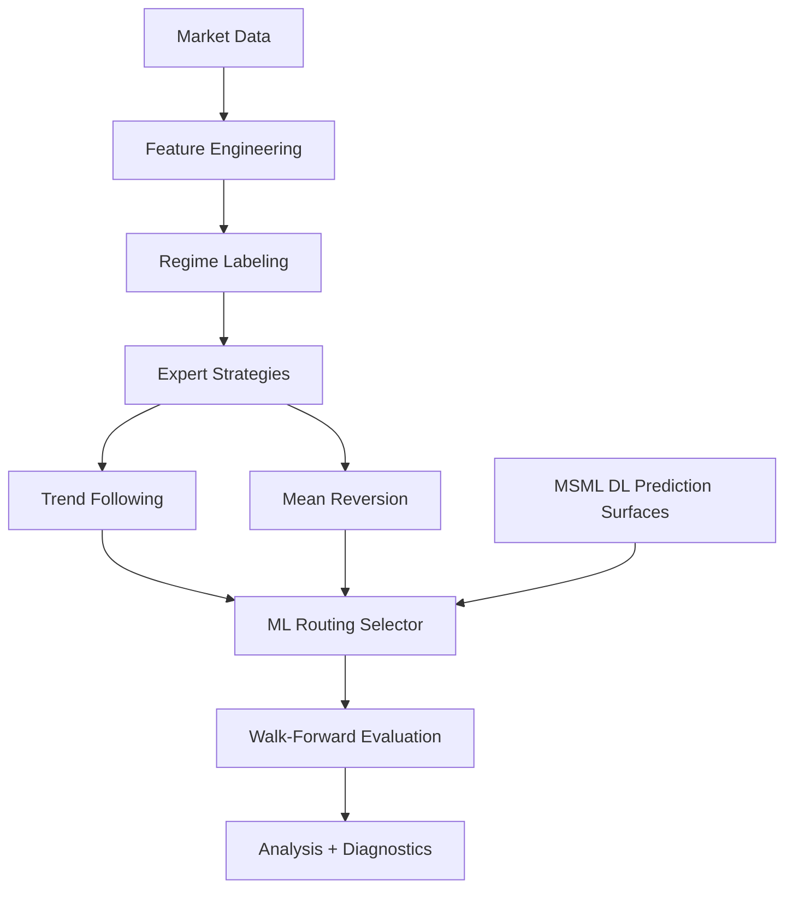
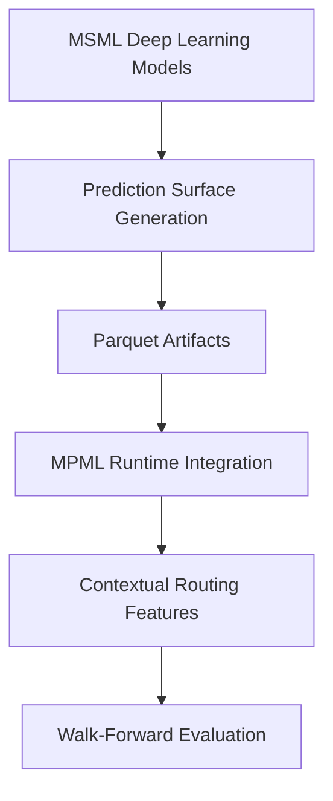

# Market-Phase-ML (MPML)

A regime-aware mixture-of-experts framework for non-stationary time-series modeling.

MPML combines:

- rule-based expert strategies
- machine-learning routing/gating
- walk-forward evaluation
- reproducible experiment infrastructure
- optional deep-learning sentiment surfaces from the companion MSML project

The repository explores how contextual information — market regime, volatility structure, and optional deep-learning prediction surfaces — can be used to dynamically route between specialized strategies under realistic out-of-sample evaluation.

While the application domain is FX trading, the broader focus is:

> contextual decision routing for non-stationary environments.

---

# Project Overview

Traditional ML pipelines often assume:

- stationary data distributions
- fixed predictive relationships
- stable strategy behavior over time

Financial markets violate all three assumptions.

MPML investigates whether a mixture-of-experts architecture can improve robustness by:

- detecting changing market regimes
- dynamically selecting specialized strategies
- evaluating decisions under strict walk-forward validation
- integrating optional deep-learning prediction surfaces generated by a separate ML pipeline

The framework emphasizes:

- realistic evaluation
- leakage prevention
- reproducibility
- failure-mode analysis
- provenance-aware experimentation

---

# System Architecture



---

## Core MPML Pipeline

```text
Market data
    ↓
Feature engineering
    ↓
Regime labeling
    ↓
Specialized expert strategies
    ├── Trend Following (TF)
    └── Mean Reversion (MR)
            ↓
ML routing / gating selector
            ↓
Walk-forward evaluation
            ↓
Analysis + reproducibility framework
```

---

## MSML Integration



---

MPML optionally integrates deep-learning prediction surfaces from the companion project:

> Market-Sentiment-ML (MSML)

MSML trains deep-learning models on FX sentiment and price structure data and exports prediction surfaces as parquet artifacts.

MPML treats these artifacts as:

> validated external feature surfaces

that can be attached to the routing layer during walk-forward evaluation.

```text
MSML
(DL prediction surfaces)
        ↓
Validated parquet artifacts
        ↓
MPML feature integration
        ↓
Context-aware strategy routing
        ↓
Walk-forward evaluation
```

This separation allows:

- independent experimentation
- reproducible artifact provenance
- leakage-safe integration boundaries
- transfer-learning style evaluations

---

# Engineering Highlights

## Regime-Aware Mixture-of-Experts Routing

MPML dynamically routes between specialized strategies using:

- engineered market-state features
- volatility structure
- regime labels
- optional DL-derived contextual signals

The system supports:

- static baselines
- PhaseAware routing
- dynamic ML gating via XGBoost selectors

---

## Leakage-Safe Walk-Forward Evaluation

The evaluation pipeline uses:

- expanding-window training
- strict causal fold boundaries
- positional fold validation
- overlap-aware DL evaluation windows
- deterministic replay support

The framework was repeatedly hardened against:

- lookahead leakage
- fold overlap contamination
- non-causal boundary collapse
- feature-schema drift

---

## Provenance-Aware Experiment Infrastructure

Every run emits:

- immutable run directories
- canonical manifests
- experiment provenance metadata
- runtime factor metadata
- experiment-surface metadata
- reproducibility diagnostics

The analysis framework supports:

- factor-conditioned comparisons
- semantic validation
- reproducible experiment grouping
- transfer-style analysis

---

## DL Surface Integration

DL features are integrated through:

- schema validation
- feature-surface provenance
- runtime manifest propagation
- imputation-awareness controls
- deterministic feature ordering

The integration layer was designed to tolerate:

- sparse temporal coverage
- missing DL intervals
- partial feature availability
- evolving artifact schemas

---

# Key Findings

## Classical MPML Findings

- Regime-aware routing improved robustness in several market conditions.
- Dynamic selectors often reduced drawdown relative to static baselines.
- Trend-following and mean-reversion strategies behaved differently across volatility regimes.
- Walk-forward gains were generally modest but more stable than naive in-sample optimization.

---

## Failure Analysis Findings

The project intentionally preserves negative results and failure modes.

Key observations included:

- volatility spikes exposed selector instability
- some routing improvements disappeared under stricter causal validation
- several promising configurations failed to generalize out-of-sample
- transfer behavior varied significantly across pair families

The repository treats:

> realistic failure analysis

as a first-class research objective.

---

## MSML Integration Findings

The DL integration experiments showed:

- conditional rather than universal uplift
- strong dependence on pair-family transfer structure
- sensitivity to temporal coverage windows
- important interactions between sentiment features and volatility structure

Several experiments produced weak or negative results.

Those findings are intentionally documented rather than hidden.

---

# Research Notebook

The repository also contains a notebook-driven engineering case study:

`notebooks/01_regime_gating_walkforward.ipynb`

The notebook provides:

- walk-forward evaluation visualizations
- selector-routing inspection
- equity/drawdown comparisons
- volatility-spike case studies
- fold-level diagnostics

The notebook operates on exported CSV artifacts and does not retrain models.

See:

`notebooks/README_NOTEBOOK.md`

for reproduction instructions and expected artifacts.

---

# Repository Structure

```text
market-phase-ml/
├── analysis/          # Experiment analysis + reporting
├── docs/              # Architecture + research documentation
├── features/          # Feature engineering
├── notebooks/         # Research notebooks
├── src/               # Core ML + strategy infrastructure
├── tests/             # Regression + ontology tests
├── main.py            # Main experiment entrypoint
├── README.md
└── RESULTS.md
```

---

# Quickstart

## Installation

```bash
pip install -r requirements.txt
```

---

## Run MPML

```bash
python main.py
```

Outputs are written into immutable run-owned directories under: `results_archive/`

Optional market-data backend override:

```bash
export MPML_DATA_SOURCE=yfinance    # default
# or
export MPML_DATA_SOURCE=broker_csv  # loads broker H1 CSVs and aggregates to D1
# optional override for broker file root
export MPML_BROKER_DATA_DIR=../market-sentiment-ml/data/input/fx
python main.py
```

`broker_csv` reads OHLCV-only input from `../market-sentiment-ml/data/input/fx/` (for example `EURUSD60.csv`).

---

## Run Analysis Pipeline

```bash
python analysis/pipeline.py results_archive/
```

---

## Run Experiment Matrix

```bash
./run_v5_full_matrix.sh
```

---

# Documentation Map

| Topic | Location |
|---|---|
| Experimental findings | `RESULTS.md` |
| Selector/gating architecture | `docs/architecture/selector_architecture.md` |
| Walk-forward evaluation pipeline | `docs/architecture/walkforward_pipeline.md` |
| DL integration contract | `docs/integration/dl_surface_integration.md` |
| Analysis/provenance framework | `docs/research/analysis_framework_v2.md` |
| Regime taxonomy | `docs/regimes/` |

---

# Research Themes

The repository primarily explores:

- contextual routing in non-stationary systems
- mixture-of-experts architectures
- walk-forward ML evaluation
- hybrid symbolic/ML systems
- transfer learning across related domains
- robustness under distribution shift
- provenance-aware experimentation

---

# Technologies

- Python
- pandas
- NumPy
- scikit-learn
- XGBoost
- matplotlib
- parquet/Arrow
- walk-forward evaluation infrastructure
- reproducible ML experimentation

---

# Related Project

## Market-Sentiment-ML (MSML)

Companion repository responsible for:

- FX sentiment dataset construction
- deep-learning model training
- prediction-surface generation
- parquet artifact export

MPML consumes those exported artifacts as validated feature surfaces during walk-forward evaluation.

---

# Current Status

The repository currently supports:

- classical regime-aware routing
- dynamic selector experiments
- DL surface integration
- factor-conditioned experiment analysis
- provenance-aware experiment infrastructure
- reproducible walk-forward evaluation

Current research directions include:

- transfer-learning behavior across pair families
- overlap-aware DL evaluation windows
- HTF vs LVTF surface transfer
- selector calibration
- online adaptation
- feature attribution analysis

---

# Disclaimer

This repository is a research and engineering project.

It is not financial advice.

The primary focus is:

- ML systems engineering
- contextual routing architectures
- evaluation methodology
- reproducible experimentation
- robustness analysis
