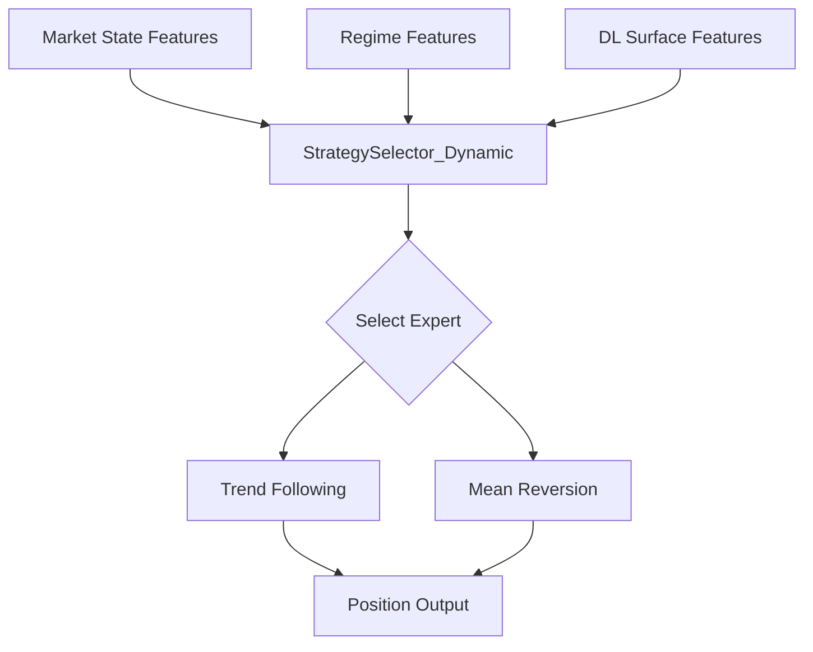

# Selector Architecture

# Overview

The MPML selector layer implements a:

> regime-aware mixture-of-experts routing system

for non-stationary time-series environments.

Rather than relying on a single monolithic strategy, the framework dynamically routes between specialized expert strategies using:

- engineered market-state features
- volatility structure
- regime information
- optional deep-learning prediction surfaces

The selector architecture evolved from:

- static rule-based routing
- toward ML-driven contextual decision making
- under strict walk-forward evaluation constraints.

---

# High-Level Architecture



---

```text
Feature Engineering
        ↓
Regime Labeling
        ↓
Specialized Experts
    ├── Trend Following (TF)
    └── Mean Reversion (MR)
            ↓
Selector Layer
    ├── PhaseAware
    └── StrategySelector_Dynamic
            ↓
Expert Selection
            ↓
Position Generation
            ↓
Walk-Forward Evaluation
```

---

# Design Philosophy

The selector architecture is based on the observation that:

> different market conditions favor different strategy behaviors.

Examples:

| Market State | Potentially Favored Expert |
|---|---|
| Strong directional trend | Trend Following |
| Range-bound / oscillatory | Mean Reversion |
| High-volatility transitions | Context-dependent |

Instead of attempting to build:

> one universally optimal strategy

MPML explores whether:

> contextual routing between specialists

can improve robustness.

---

# Expert Strategies

## Trend Following (TF)

The TF expert attempts to exploit:

- directional continuation
- momentum persistence
- trend stability

Typical characteristics:

- stronger during sustained directional movement
- vulnerable during rapid reversals
- often sensitive to volatility spikes

---

## Mean Reversion (MR)

The MR expert attempts to exploit:

- short-term overextension
- reversion toward local equilibrium
- oscillatory market behavior

Typical characteristics:

- more stable in sideways conditions
- vulnerable during sustained breakouts
- sensitive to directional persistence

---

# Selector Types

## Static Baselines

The framework includes static baselines for comparison:

- TF-only
- MR-only
- fixed routing logic

These provide reference points for evaluating:

- dynamic routing quality
- robustness improvements
- drawdown behavior

---

## PhaseAware Selector

The PhaseAware selector introduced:

- rule-based contextual routing
- engineered regime heuristics
- explicit volatility/state handling

Characteristics:

- interpretable behavior
- deterministic routing
- limited adaptability

PhaseAware became an important stepping stone toward:

> ML-driven contextual gating.

---

## StrategySelector_Dynamic

The dynamic selector is the primary ML routing architecture.

Core responsibilities:

- observe current market state
- evaluate contextual features
- estimate expert suitability
- route to the most appropriate expert

Primary implementation:

- XGBoost-based selector models

The selector is trained using:

- walk-forward-compatible training windows
- engineered contextual features
- historical expert behavior

---

# Feature Pipeline

The selector consumes multiple categories of features.

---

## Market Structure Features

Examples include:

- trend indicators
- ATR-derived volatility features
- momentum statistics
- rolling behavior metrics
- directional persistence measures

These features attempt to characterize:

> the current market environment.

---

## Regime Features

The regime layer provides:

- market-state classification
- directional context
- volatility-state context

The regime system evolved independently and is documented separately under:

`docs/regimes/`

---

## DL Surface Features (Optional)

MPML optionally integrates deep-learning prediction surfaces from:

> Market-Sentiment-ML (MSML)

Examples:

- sentiment-derived directional statistics
- prediction aggregates
- prediction volatility
- prediction flip frequency

These are attached as:

> contextual routing features

rather than direct trading signals.

The selector therefore evaluates:

- traditional engineered state features
- plus optional DL-derived contextual information.

---

# DL Integration Architecture

## Artifact Boundary

MSML exports parquet artifacts containing prediction surfaces.

MPML treats these artifacts as:

> immutable external feature surfaces.

This creates a clean separation between:

| Project | Responsibility |
|---|---|
| MSML | DL model training + surface generation |
| MPML | Routing + evaluation |

---

## Runtime Surface Propagation

At runtime:

- parquet metadata is introspected
- feature provenance is propagated
- experiment surfaces are emitted into manifests
- analysis layers consume canonical provenance metadata

This architecture evolved after earlier failures involving:

- semantic reconstruction
- feature-order corruption
- runtime attribution drift

---

# Imputation Awareness

A major architectural theme became:

> handling partial or missing DL coverage.

DL surfaces are only available for limited historical windows.

This created situations where:

- some folds had DL coverage
- others did not
- some features required imputation

The framework therefore introduced:

| Mode | Description |
|---|---|
| Blind | Selector does not observe imputation state |
| Aware | Missing/imputed state propagated explicitly |

The selector can therefore reason about:

> feature reliability

rather than treating all inputs equally.

---

# Feature Schema Hardening

One of the most important engineering evolutions in the project involved:

> selector schema integrity.

Early DL integration experiments uncovered:

- silent feature-order drift
- schema mismatch corruption
- hidden sklearn alignment failures
- fallback behavior masking runtime corruption

The selector infrastructure was hardened using:

- deterministic feature ordering
- canonical feature schemas
- hard-fail validation
- runtime schema assertions
- manifest provenance propagation
- regression tests

The system now treats:

> schema mismatch

as a hard runtime error.

---

# Selector Lifecycle

## Training Phase

During training:

1. historical folds are constructed
2. features are assembled
3. optional DL surfaces are attached
4. imputation indicators are generated
5. canonical feature ordering is frozen
6. selector models are trained

The selector learns:

> contextual expert suitability.

---

## Inference Phase

During inference:

1. current market state is assembled
2. DL surfaces are attached if available
3. imputation handling is applied
4. feature schema validation occurs
5. canonical feature alignment is enforced
6. selector predicts expert suitability
7. expert routing decision is produced

The inference pipeline is intentionally:

- deterministic
- schema-validated
- provenance-aware

---

# Failure Modes

A major focus of the project became:

> explicit identification of selector failure modes.

Observed issues included:

- volatility-spike instability
- transfer failures across pair families
- routing collapse during abrupt transitions
- sparse DL coverage degradation
- hidden fallback masking
- feature-schema corruption

These findings motivated:

- volatility guards
- overlap-aware evaluation
- provenance-aware manifests
- anti-corruption validation
- deterministic replay infrastructure

---

# Evaluation Philosophy

The selector architecture prioritizes:

- robustness
- stability
- realistic evaluation
- causal integrity
- reproducibility

rather than:

- aggressive in-sample optimization
- fragile peak metrics
- static benchmark overfitting

The project increasingly evolved toward:

> contextual ML systems engineering

rather than merely:

> strategy optimization.

---

# Current Research Directions

Current selector-related research includes:

- transfer-learning behavior across pair families
- selector calibration
- HTF vs LVTF surface transfer
- online adaptation
- alternate gating architectures
- confidence-aware routing
- feature attribution analysis
- robustness under distribution shift

---

# Related Documentation

| Topic | Location |
|---|---|
| Walk-forward evaluation pipeline | `docs/architecture/walkforward_pipeline.md` |
| DL integration contract | `docs/integration/dl_surface_integration.md` |
| Analysis/provenance framework | `docs/research/analysis_framework_v2.md` |
| Regime taxonomy | `docs/regimes/` |
| Experimental findings | `RESULTS.md` |

