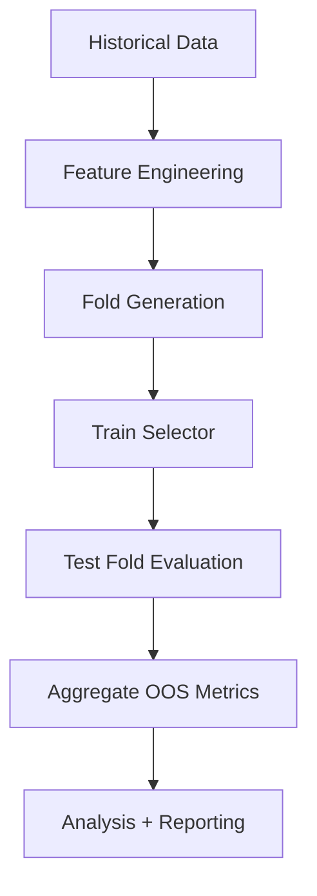
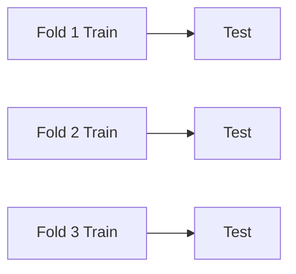

# Walk-Forward Evaluation Pipeline

# Overview

The MPML evaluation pipeline is built around:

> leakage-safe walk-forward validation

for non-stationary time-series systems.

A major goal of the repository became:

> realistic out-of-sample evaluation.

The framework repeatedly evolved in response to discovered failure modes involving:

- lookahead leakage
- temporal contamination
- fold-boundary collapse
- overlap-window contamination
- selector instability
- runtime attribution drift

The walk-forward pipeline therefore became one of the central engineering components of the project.

---

# Core Philosophy

Traditional ML evaluation approaches often assume:

- IID samples
- stationary distributions
- random train/test validity

Financial time-series violate these assumptions.

MPML therefore prioritizes:

- strict temporal causality
- expanding-window evaluation
- reproducibility
- robustness over peak metrics

The evaluation pipeline intentionally favors:

> conservative realism

rather than:

> optimistic backtest performance.

---

# High-Level Pipeline



---

```text
Historical Market Data
            ↓
Feature Engineering
            ↓
Regime Labeling
            ↓
Walk-Forward Fold Generation
            ↓
Train Selector / Experts
            ↓
Evaluate Sequential Test Fold
            ↓
Aggregate OOS Results
            ↓
Analysis + Diagnostics
```

---

# Expanding-Window Evaluation



---

The framework primarily uses:

> expanding-window walk-forward evaluation.

Each fold:

- trains on historical data available up to time T
- evaluates on future unseen data
- advances forward sequentially

Example:

```text
Fold 1:
[ TRAIN ===== ] [ TEST ]

Fold 2:
[ TRAIN ========= ] [ TEST ]

Fold 3:
[ TRAIN ============= ] [ TEST ]
```

This approach more closely approximates:

> real deployment conditions.

---

# Fold Construction

## Positional Fold Boundaries

One important engineering evolution involved:

> causal fold boundary enforcement.

Earlier implementations used calendar-derived boundaries that occasionally collapsed onto the same trading bar due to sparse or irregular timestamps.

This created subtle contamination risks where:

- train_end
- and test_start

could resolve to the same bar.

The framework therefore transitioned to:

> positional boundary enforcement.

Test folds now begin strictly after the final training bar.

---

## Causal Integrity

The pipeline explicitly prevents:

- train/test overlap
- future leakage
- shared-bar contamination
- temporal lookahead

These constraints became increasingly strict as the repository evolved.

---

# Walk-Forward Objectives

The evaluation pipeline attempts to measure:

- robustness
- consistency
- adaptability
- failure behavior
- transfer stability

rather than simply:

- maximizing isolated backtest metrics.

This distinction became one of the central design philosophies of the project.

---

# Selector Evaluation

The selector layer is retrained within walk-forward windows.

This ensures:

- training only uses historically available information
- selector routing decisions remain causal
- regime adaptation occurs incrementally over time

The framework therefore evaluates:

> adaptive contextual routing

under realistic sequential deployment conditions.

---

# DL Surface Integration Constraints

A major complexity emerged after integrating:

> MSML deep-learning prediction surfaces.

The DL artifacts only cover:

- modern historical windows (~2019+)

which introduced:

- sparse temporal coverage
- overlap-window constraints
- partial historical availability
- missing-feature propagation challenges

---

# Overlap-Aware Evaluation

Several experiments introduced:

> overlap-only evaluation windows.

These restrict evaluation to periods where:

- DL surfaces exist
- all required contextual features are available

This avoids:

- partial historical contamination
- invalid feature comparisons
- inconsistent selector inputs

The framework increasingly treated:

> temporal coverage integrity

as a first-class evaluation concern.

---

# Imputation Awareness

Sparse DL coverage created situations where:

- some folds lacked DL features
- some features required imputation
- some routing decisions depended on incomplete context

The pipeline therefore introduced:

| Mode | Description |
|---|---|
| Blind | Selector unaware of imputation state |
| Aware | Imputation state propagated explicitly |

This allowed experiments investigating whether selectors should:

> reason about feature reliability.

---

# Volatility Guards

Several experiments revealed selector instability during:

- volatility spikes
- abrupt regime transitions
- sudden directional reversals

The framework therefore introduced:

- volatility diagnostics
- fold-level guard metrics
- robustness analysis
- selector degradation monitoring

These diagnostics became important for:

> failure-aware evaluation.

---

# Diagnostics Infrastructure

The walk-forward pipeline emits:

- per-fold metrics
- per-pair summaries
- selector diagnostics
- volatility diagnostics
- DL coverage statistics
- manifest provenance metadata

This enables:

- post-hoc analysis
- reproducible experiment grouping
- factor-conditioned comparisons
- transfer analysis

---

# Reproducibility Infrastructure

A major engineering focus became:

> deterministic replayability.

The framework introduced:

- immutable run directories
- canonical manifests
- deterministic seeding
- provenance-aware experiment surfaces
- schema hardening
- ontology-aware analysis validation

This infrastructure evolved after earlier failures involving:

- semantic reconstruction
- attribution drift
- runtime ambiguity
- selector schema corruption

---

# Provenance-Aware Evaluation

Modern MPML runs emit:

- runtime experiment metadata
- experiment surface provenance
- artifact metadata
- feature-surface metadata
- training/evaluation family metadata
- reproducibility metadata

The analysis layer consumes these manifests directly.

This prevents:

- post-hoc semantic reconstruction
- variant-driven attribution corruption
- hidden runtime assumptions

---

# Failure Modes Observed

The walk-forward infrastructure uncovered multiple important failure modes.

Examples included:

- strategies collapsing under volatility spikes
- selector instability during transitions
- transfer-learning degradation
- DL overlap contamination
- schema mismatch corruption
- hidden fallback masking
- semantic attribution drift

Many later infrastructure improvements originated from:

> observed evaluation failures.

---

# Research Philosophy

The project increasingly evolved toward:

> robustness-oriented ML systems engineering.

The evaluation framework therefore prioritizes:

- causal integrity
- reproducibility
- conservative realism
- transfer robustness
- failure visibility

rather than:

- optimistic in-sample optimization.

---

# Current Research Directions

Current evaluation-focused research includes:

- overlap-aware DL windows
- HTF vs LVTF transfer
- selector calibration
- online adaptation
- confidence-aware routing
- feature attribution analysis
- robustness under distribution shift

---

# Related Documentation

| Topic | Location |
|---|---|
| Selector/gating architecture | `docs/architecture/selector_architecture.md` |
| DL integration contract | `docs/integration/dl_surface_integration.md` |
| Analysis/provenance framework | `docs/research/analysis_framework_v2.md` |
| Regime taxonomy | `docs/regimes/` |
| Experimental findings | `RESULTS.md` |

