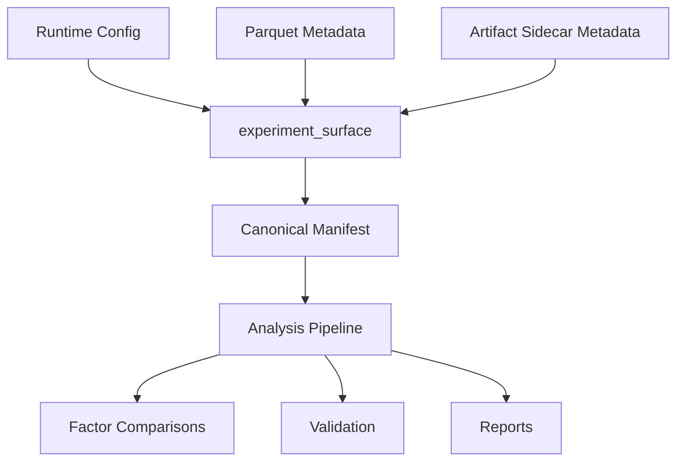

# Analysis Framework v2

> **Status:** Active — supersedes the v1 log-driven analysis scripts.

---

## Overview

The MPML analysis framework v2 is a **CSV-first, single-command** analysis
pipeline that operates on archived MPML run directories.  It replaces the
earlier multi-step, log-driven workflow with a unified orchestrator that
automatically discovers runs, parses all available outputs, generates
normalised summaries, produces cross-run comparisons, and renders a
markdown report.

---

## Quick Start

```bash
# Analyse all runs in an archive directory
python analysis/pipeline.py results_archive/

# Analyse a specific run directory
python analysis/pipeline.py results_archive/fp_gen1_A/

# Write to a custom output directory
python analysis/pipeline.py results_archive/ --output-dir reports/ --verbose
```

### Output files

| File | Description |
|------|-------------|
| `<output_dir>/summaries/<canonical_run_id>.summary.json` | Per-run normalised summary with canonical identity |
| `<output_dir>/comparisons.json` | Cross-run sentiment / gen / selector + generalized factor comparisons |
| `<output_dir>/report.md` | Human-readable report with validation, warnings, and diagnostics |

## Provenance flow



---

## Architecture

```
analysis/
├── pipeline.py                  # Single-command orchestrator
├── parsers/
│   ├── run_discovery.py         # Discover run directories in an archive
│   ├── csv_parsers.py           # Parse all recognised MPML CSV outputs
│   ├── manifest_parser.py       # Parse run_manifest.json (legacy run_manifest_*.json supported)
│   └── log_parser.py            # Legacy log parser (fallback)
├── reports/
│   └── markdown_report.py       # Markdown report renderer
├── comparisons/
│   ├── sentiment.py             # Sentiment ON vs OFF comparison
│   ├── selector.py              # Baseline vs dynamic selector uplift
│   ├── gen_comparison.py        # Gen1 vs Gen2 missing-indicator comparison
│   └── dl_conditional.py        # DL-conditioned selector analysis (--conditional-analysis)
├── diagnostics/
│   ├── __init__.py
│   ├── selector_diagnostics.py  # Entropy, switch density, confidence collapse
│   └── transition_windows.py    # DL state classification, window extraction
└── plots/                       # Plot generators (extend as needed)
```

### Data flow

```
pipeline.py
    ↓
discover_runs()        → list of (run_dir, experiment_gen)
    ↓
parse_run_csvs()       → CSV section rows (or None if absent)
parse_manifest()       → run config metadata
parse_log()            → legacy log data (fallback only)
    ↓
build_run_summary()    → normalised summary dict (JSON-serialisable)
    ↓
compare_sentiment_variants()
compare_selector_uplift()
compare_gen1_gen2()
build_dl_conditional_analysis()   ← only when --conditional-analysis
    ↓
render_markdown_report()  → report.md
```

---

## Supported MPML Outputs

### CSV files (primary data source)

| Glob pattern | Summary key | Description |
|---|---|---|
| `results_ml__*.csv` | `ml_accuracy` | In-sample ML accuracy per model/pair |
| `results_ml_backtest__*.csv` | `backtest` | First-stage backtest results |
| `walkforward_results_summary__*.csv` | `walkforward_summary` | Aggregate OOS walk-forward metrics |
| `walkforward_results_per_pair__*.csv` | `walkforward_per_pair` | Per-pair OOS walk-forward metrics |
| `walkforward_results_per_fold__*.csv` | `walkforward_per_fold` | Per-fold OOS metrics |
| `baseline_vs_dynamic_comparison__*.csv` | `selector_comparison` | Selector uplift: PhaseAware vs Dynamic |
| `ablation_summary_aggregate__*.csv` | `ablation_aggregate` | In-sample ablation (aggregate) |
| `ablation_summary_per_pair__*.csv` | `ablation_per_pair` | In-sample ablation (per pair) |
| `vol_guard_diagnostics_summary__*.csv` | `vol_guard_summary` | Vol guard suppression summary |
| `vol_guard_diagnostics_per_fold__*.csv` | `vol_guard_per_fold` | Vol guard per-fold breakdown |
| `results_summary__*.csv` | `results_summary` | Top-level results (v2 format) |
| `results_per_pair__*.csv` | `results_per_pair` | Per-pair results (v2 format) |
| `selector_state_timeline.csv` | `selector_state_timeline` | Optional per-bar selector state (Tier 2 diagnostics) |

Both `__baseline` and `__dl_enabled` file variants are collected and
annotated with a `_mode_tag` field before merging.

### Manifest files (configuration)

Run manifests (`run_manifest.json`; legacy `run_manifest_*.json`) are parsed for:

- `experiment.*` — **canonical experiment semantics** (primary source of truth)
- `dl.dl_enabled` — whether DL signals were active
- `dl.dl_surface` — DL model / regime / horizon specification
- `dl.dl_artifact_path` — path to the DL parquet artifact
- `walkforward.*` — fold parameters (train years, test months, etc.)
- `flags.*` — pipeline feature flags
- `reproducibility.*` — experiment seed metadata propagated from runtime seeding
- `feature_ordering.*` — canonical feature column ordering captured at runtime
- `run.run_id`, `run.git_sha`, `run.timestamp_utc`

Each run directory must contain **exactly one** run manifest.
Multiple manifests in one run root are treated as an integrity failure.

#### Manifest experiment schema (factor-first; required fields)

The `experiment` block is the **single source of truth** for all semantic attribution.
Semantics are **never** inferred from DL flags, folder names, or runtime state.

```json
{
  "experiment": {
    "run_family": "factorial_v1",
    "generation": "gen1",
    "variant": "B",
    "sentiment_enabled": false,
    "missing_indicators_enabled": false,
    "factors": {
      "dl_enabled": false,
      "sentiment_enabled": false,
      "missing_indicators_enabled": false,
      "msml_regime": "LVTF",
      "overlap_only": false,
      "selector_enabled": true
    },
    "semantic_label": "Gen1_B"
  }
}
```

| Field | Type | Required | Description |
|---|---|---|---|
| `run_family` | `str` | ✓ | Factor ontology version (currently `factorial_v1`) |
| `generation` | `"gen1"` \| `"gen2"` | ✓ | Legacy generation label (backward compatibility) |
| `variant` | `str` | ✓ | Legacy shorthand label (A/B/C/D historically) |
| `factors` | `dict` | ✓ | Source-of-truth factor state for cohorting/comparisons |
| `sentiment_enabled` | `bool` | compat | Legacy mirror of `factors.sentiment_enabled` |
| `missing_indicators_enabled` | `bool` | compat | Legacy mirror of `factors.missing_indicators_enabled` |
| `semantic_label` | `str` | ✓ | Human-readable label (e.g. `"Gen1_B"`) |

**Important distinctions:**

- `sentiment_enabled` ≠ `flags.DL_SIGNALS_ENABLED` — the DL infrastructure may be active
  while the actual DL signal contribution is disabled or ablated. `sentiment_enabled` is the
  canonical flag for whether DL features are truly included in model inputs.
- `missing_indicators_enabled` must **not** be inferred from feature column names after the
  fact. It must be set explicitly at runtime.

Legacy A/B/C/D shorthand mapping:

| Variant | `generation` | `sentiment_enabled` | `missing_indicators_enabled` |
|---------|-------------|---------------------|------------------------------|
| A | gen1 | `true` | `false` |
| B | gen1 | `false` | `false` |
| C | gen2 | `true` | `true` |
| D | gen2 | `false` | `true` |

Legacy manifests without the `experiment` block are tolerated with warnings and reported
as `variant=U` (unknown). They remain analyzable via compatibility fallbacks.

### Log files (legacy fallback)

`*.txt` log files are parsed as a fallback when CSV outputs are absent.
The log parser extracts:

- In-sample ML accuracy rows
- Backtest result rows (from the "ML Backtest Results Summary" table)
- DL coverage lines (`[DL] PAIR: DL coverage (any col)=X%`)
- Warnings / diagnostics

---

## Normalised Summary JSON

Each run produces a `<canonical_run_id>.summary.json` with this structure:

```json
{
  "run_id": "gen1_A__20260512T074801Z__fp_gen1_A",
  "meta": {
    "experiment_gen": "gen1",
    "run_variant": "A",
    "semantic_run_name": "gen1_A",
    "semantic_run_id": "gen1_A__20260512T074801Z",
    "run_meaning": "sentiment ON + missing indicator OFF (Gen1)",
    "archive_relpath": "fp_gen1_A",
    "dl_enabled": true,
    "dl_surface": { "model": "mlp", "dl_regime": "LVTF", ... },
    "dl_surface_string": "mlp/LVTF/h24/price_trend",
    "walkforward_params": { "train_years": 7, "test_months": 6, ... },
    "flags": { "DL_SIGNALS_ENABLED": true, "RUN_WALKFORWARD": true, ... },
    "reproducibility": {
      "experiment_seed": 42,
      "numpy_seed": 42,
      "python_random_seed": 42,
      "torch_seed": 42
    },
    "feature_ordering": {
      "dl_feature_columns": ["dl_signal_mean_24h"],
      "phase_predictor_by_pair": {
        "EURUSD": ["adx", "atr_pct", "dl_signal_mean_24h"]
      },
      "strategy_selector_by_pair": {
        "EURUSD": ["adx", "atr_pct", "plus_di"]
      }
    },
    "git_sha": "89c81974...",
    "timestamp_utc": "20260512T074801Z",
    "run_dir": "results/evidence/dl_v1_preliminary_eurusd_lvtf"
  },
  "csvs": {
    "ml_accuracy": [...],
    "backtest": [...],
    "walkforward_summary": null,
    "walkforward_per_pair": null,
    "walkforward_per_fold": null,
    "selector_comparison": null,
    "ablation_aggregate": null,
    "ablation_per_pair": null,
    "vol_guard_summary": null,
    "vol_guard_per_fold": null,
    "results_summary": null,
    "results_per_pair": null,
    "selector_state_timeline": null
  },
  "log": {
    "source_log": "results_dl_v1_preliminary_eurusd_lvtf.txt",
    "ml_results": [...],
    "backtests": [...],
    "diagnostics": [...],
    "dl_coverage": { "EURUSD": 94.5 }
  },
  "coverage": {
    "source": "log",
    "per_pair": { "EURUSD": 94.5 },
    "avg_coverage_pct": 94.5,
    "n_pairs": 1
  },
  "warnings": ["Missing CSV sections (partial run or older format): ..."]
}
```

`null` values indicate absent CSV files. Structural corruption (e.g.
duplicate canonical identities or malformed archives) fails validation
loudly before final output.

Reproducibility validation also warns when:

- a manifest is missing any canonical seed field
- repeated runs sharing the same `experiment_seed` carry different seed metadata
- repeated runs sharing the same `experiment_seed` capture different feature column order

---

## Experiment Semantics

> **Integrity rule:** semantics are **canonical and immutable**. The parser reads
> `manifest.experiment` directly. No heuristic inference from DL flags, folder names,
> or runtime state is ever performed. Legacy manifests without the experiment block are
> tolerated with warnings only.

### Gen1 vs Gen2 (Missing-Indicator Semantics)

The "generation" refers to how the pipeline handles bars where the DL
prediction surface provides no data:

| Generation | Behaviour | `dl_missing_indicator` column |
|---|---|---|
| **Gen1** | Absent DL features → `NaN` → PhaseAware fallback via NaN guard | Absent |
| **Gen2** | Absent DL features → `NaN` + explicit boolean indicator column | Present |

Gen2 allows the XGBoost gating model to learn a distinct policy for
"DL data unavailable" bars, rather than silently falling back.

**Semantics policy (integrity mode):**

- trust explicit `manifest["experiment"]` metadata only
- required fields: `generation`, `variant`, `sentiment_enabled`, `missing_indicators_enabled`, `semantic_label`
- do **not** infer semantics from folder/file naming heuristics
- legacy runs without the experiment block are tolerated with warnings

### Sentiment ON vs OFF

"Sentiment" means the DL prediction surface (from `market-sentiment-ml`)
is attached as additional feature columns to each bar:

| Mode | `experiment.sentiment_enabled` | Description |
|---|---|---|
| **Sentiment ON** | `true` | DL prediction features active in model inputs |
| **Sentiment OFF** | `false` | Pure regime/feature baseline |

**Note:** `sentiment_enabled` is the canonical flag. It is **not** the same as
`flags.DL_SIGNALS_ENABLED` — the DL infrastructure may be active while the DL signal
contribution is ablated. Always read `manifest.experiment.sentiment_enabled`.

### Factor-conditioned comparisons

Comparisons no longer rely on hardcoded A/B/C/D pairings. The engine supports:

- arbitrary factor filtering (`dl_enabled`, `sentiment_enabled`, `missing_indicators_enabled`, `msml_regime`, `overlap_only`, `selector_enabled`)
- generation-conditioned or regime-conditioned slices
- mixed DL/non-DL cohort analysis
- backward-compatible legacy variant reporting

Examples:

- Sentiment ON vs OFF within each generation (`factors.sentiment_enabled`, conditioned on `generation`)
- Gen1 vs Gen2 within each sentiment state
- DL-enabled vs no-DL baselines (`factors.dl_enabled`)
- Regime slices by `factors.msml_regime` (e.g., LVTF, LV, HTF)

---

## Walkforward Fold Semantics

Walk-forward folds use **strictly causal positional boundaries**:

```python
test_start_pos = train_end_pos + 1
```

This replaced the earlier calendar-based date snap, which could cause
subtle train/test boundary leakage on sparse or non-uniform timestamp
series.

**Implication for analysis:** fold continuity and overlap should be
assessed using positional indices (the `Fold` column in
`walkforward_results_per_fold`), not calendar date arithmetic.

---

## Selector Uplift

`baseline_vs_dynamic_comparison__*.csv` captures the per-pair uplift of
the XGBoost-gated `StrategySelector_Dynamic` over the rule-based
`PhaseAware` baseline on OOS walk-forward folds:

- **Positive Sharpe_Delta** → ML routing outperforms hand-coded regime policy
- **Negative Sharpe_Delta** → ML routing underperforms; baseline preferred

The `compare_selector_uplift()` function aggregates this across runs and
exposes per-pair mean deltas.  If the dedicated comparison CSV is absent,
it falls back to `Sharpe_Delta` columns in `walkforward_results_summary`.

---

## Archive Structure

Recommended archive layout:

```
results_archive/
├── fp_gen1_A/              # Gen1, Sentiment ON
│   ├── run_manifest.json
│   ├── walkforward_results_summary__dl_enabled.csv
│   ├── ablation_summary_aggregate__dl_enabled.csv
│   └── ...
├── fp_gen1_B/              # Gen1, Sentiment OFF (baseline)
│   ├── run_manifest.json
│   └── ...
├── fp_gen2_C/              # Gen2, Sentiment ON
│   └── ...
└── fp_gen2_D/              # Gen2, Sentiment OFF (baseline)
    └── ...
```

Running `python analysis/pipeline.py results_archive/` will discover
all four directories, build summaries, and generate A vs B and C vs D
sentiment comparisons automatically.

Discovery hardening:

- run roots are manifest-centric (exactly one run manifest)
- nested subdirectories under a discovered run root are not re-scanned
- CSV-only fallback is legacy-only and requires `.mpml_legacy_run_root`

Canonical identity rule:

`<gen>_<variant>__<timestamp>__<archive_relpath_slug>`

Example:

- `gen1_A__20260521T131739Z__fp_gen1_A`
- `gen2_C__20260521T141210Z__fp_gen2_C`

This avoids run-id collisions when manifest timestamps are reused.

---

## Structural Validation

The pipeline performs semantic and provenance integrity checks before writing output.
Validation **hard-fails** (raises `RuntimeError`) on:

| Condition | Severity |
|---|---|
| Duplicate canonical `run_id` | Error |
| Duplicate `semantic_run_id` across roots | Error |
| Multiple manifests in one run root | Error |
| No manifests, no CSVs, no log (empty run) | Error |
| Invalid `experiment.generation` value | Error |
| Invalid `experiment.variant` value | Error |
| Cross-generation variant conflict (e.g. gen1 run with variant=C) | Error |
| Semantic inconsistency (variant conflicts with generation + sentiment) | Error |

Validation emits **warnings** (non-fatal) for:

| Condition | Severity |
|---|---|
| Missing `experiment` block in manifest | Warning |
| Incomplete `experiment` fields | Warning |
| Duplicate semantic variant within cohort (e.g. two Gen1_B runs) | Warning |
| Missing reproducibility seed metadata | Warning |
| Missing feature ordering metadata | Warning |
| Absent optional CSV sections | Warning |

Cohort construction rules:

- Sentiment comparison (A vs B, C vs D) is **generation-scoped** — A may only be compared to B, and C to D.
- Gen comparison (A vs C, B vs D) is **sentiment-scoped** — A may only be compared to C, and B to D.
- Incomplete cohorts produce warnings and skip that comparison; they are **never silently mixed**.
- Unknown-variant (`U`) runs are always excluded from all comparisons.

---

## Partial Run Handling

The pipeline handles partial and failed runs gracefully:

| Scenario | Behaviour |
|---|---|
| Missing CSV files | Corresponding section in summary is `null`; warning emitted |
| No manifest | legacy mode only; allowed when explicit legacy marker is present |
| Corrupt/invalid CSV | Error captured in `_errors`; other files continue |
| Malformed manifest JSON | Hard error (pipeline fails) |
| Multiple manifests in one run root | Hard error (pipeline fails) |
| Duplicate canonical identities | Validation error (pipeline fails) |
| No CSVs and no log | Validation error (malformed archive) |
| Empty archive | Message printed; no crash |

Report sections for missing data show `⚠ Data not available` rather
than crashing or omitting the section header.

---

## Research Questions Supported

| Question | Data source | Pipeline section |
|---|---|---|
| Sentiment ON/OFF (A vs B, C vs D) | `walkforward_summary` + canonical variant semantics | `comparisons.sentiment` |
| Gen1 vs Gen2 missing-indicator semantics | `walkforward_summary` + canonical variant semantics | `comparisons.gen` |
| Walkforward OOS Sharpe / return / DD | `walkforward_results_summary__*.csv` | `csvs.walkforward_summary` |
| Fold stability | `walkforward_results_per_fold__*.csv` | `csvs.walkforward_per_fold` |
| Selector uplift (aggregate + per-pair) | `baseline_vs_dynamic_comparison__*.csv` | `comparisons.selector` |
| DL coverage (per pair) | log `[DL]` lines or `vol_guard_diagnostics` | `coverage.per_pair` |
| Vol guard suppression rate | `vol_guard_diagnostics_summary__*.csv` | `csvs.vol_guard_summary` |
| DL-active-only vs DL-missing metrics | `walkforward_results_per_fold` + `--conditional-analysis` | `comparisons.conditional` |
| Selector entropy (fold-level proxy) | `walkforward_results_per_fold` + `--conditional-analysis` | `comparisons.conditional.aggregate_table[].selector_entropy` |
| Switch density + hold duration | `selector_state_timeline.csv` + `--conditional-analysis` | `comparisons.conditional.aggregate_table[].switches_per_1000_bars` |
| Transition window analysis | `selector_state_timeline.csv` + `--conditional-analysis` | `comparisons.conditional.per_run[].transition_summary` |
| Confidence collapse diagnostics | `selector_state_timeline.csv` + `--conditional-analysis` | `comparisons.conditional.per_run[].confidence_collapse` |

---

## Migration from v1 Scripts

The v1 scripts are preserved but deprecated:

| Old script | Status | Replacement |
|---|---|---|
| `analysis/summarize_run.py` | **Deprecated** — log-driven | `analysis/parsers/log_parser.py` (internal fallback) + `pipeline.py` |
| `analysis/compare_runs.py` | **Deprecated** — JSON summary input | `analysis/pipeline.py` with `comparisons.json` output |
| `analysis/render_run_report.py` | **Deprecated** — JSON summary input | `analysis/reports/markdown_report.py` (internal) + `pipeline.py` |
| `analysis/analyze_sentiment_by_phase.py` | **Retained** — live-run notebook helper | No direct replacement; use for exploratory analysis |

**Migration steps:**

1. Archive your run directories (copy `results/` subdirectories to
   `results_archive/<run_name>/`).
2. Run `python analysis/pipeline.py results_archive/`.
3. Open `analysis/output/report.md` for the unified report.
4. Retire calls to `summarize_run.py`, `compare_runs.py`,
   `render_run_report.py` from any CI or analysis scripts.

---

## DL-Conditioned Selector Analysis

> Added in the V5 analysis PR. Backwards-compatible — disabled by default.

### Overview

The `--conditional-analysis` flag enables a second analysis pass that slices
V5 walk-forward fold data into DL-state-conditioned windows and computes
selector diagnostics on each slice, answering questions such as:

- Does DL reduce selector entropy?
- Does DL stabilise routing?
- Are reactive failures transition-dominated?
- Does selector geometry change materially during DL-active periods?

### Enabling conditional analysis

```bash
python analysis/pipeline.py results_archive/ --conditional-analysis
```

When enabled, `comparisons.json` gains a top-level `"conditional"` key and
`report.md` gains a **DL-Conditioned Selector Analysis** section.

### Architecture

```
analysis/
├── comparisons/
│   └── dl_conditional.py      # Entry point: build_dl_conditional_analysis()
└── diagnostics/
    ├── __init__.py
    ├── selector_diagnostics.py # Entropy, switch density, confidence collapse
    └── transition_windows.py   # DL state classification, window extraction
```

### DL state classification

Walk-forward fold rows can carry **per-fold overlap metadata** (new in this
version), or fall back to a positional heuristic.

#### Path 1 — Per-fold timestamp overlap (canonical)

When `walkforward_results_per_fold__*.csv` contains the columns
`dl_overlap_pct`, `dl_overlap_active`, `dl_overlap_state`, and
`dl_overlap_window`, the analysis layer reads them directly:

| Column | Type | Semantics |
|---|---|---|
| `dl_overlap_pct` | float [0–100] | Fraction of fold bars with active DL coverage |
| `dl_overlap_active` | bool | True when state is `"active"` (≥ 95 % coverage) |
| `dl_overlap_state` | str | `"active"` / `"partial"` / `"missing"` |
| `dl_overlap_window` | str | ISO 8601 interval string for the fold's DL window |

State semantics:

| `dl_overlap_state` | `dl_overlap_pct` range | Meaning |
|---|---|---|
| `active` | ≥ 95 % | Full DL coverage |
| `partial` | 5 %–95 % | Partial DL coverage |
| `missing` | ≤ 5 % | No meaningful DL coverage |

Both `"active"` and `"partial"` folds are counted towards the `dl_active`
conditional window; the `dl_state_assignment_method` is reported as
`"per_fold_timestamp_overlap"`.  Aggregate `overlap_fold_coverage_pct` is
recomputed from the per-fold data as `(active + partial) / total * 100`.

Transition labels are derived from consecutive-fold state changes:

- **`dl_transition_enter`** — fold immediately following a `missing → active/partial` change.
- **`dl_transition_exit`** — fold immediately following an `active/partial → missing` change.

#### Path 2 — Positional heuristic (legacy fallback)

When `dl_overlap_pct` is absent from the fold CSV:

1. `overlap_fold_coverage_pct` is read from `coverage.overlap_window`
   (computed from vol-guard diagnostics).
2. The last `K = round(N × pct/100)` folds per pair are labelled
   **`dl_active`**.  Walk-forward folds are temporally ordered (later
   fold index = more recent calendar period), so this approximates the
   actual DL overlap window.
3. The first `dl_active` fold per pair is relabelled **`dl_transition_enter`**.
4. Remaining folds are **`dl_missing`**.
5. When `overlap_fold_coverage_pct` is absent or `None`, all folds receive
   **`dl_state_unknown`** and are excluded from conditional metrics.

If a `selector_state_timeline.csv` is present (see below), per-bar DL state
is derived directly from the `dl_active` column, giving exact rather than
heuristic classifications.

| Label | Meaning |
|---|---|
| `dl_active` | DL overlap exists for this fold/bar |
| `dl_missing` | DL unavailable / imputed |
| `dl_transition_enter` | First fold/bar after DL becomes active |
| `dl_transition_exit` | First fold/bar after DL disappears |
| `dl_state_unknown` | Coverage information not available |

### Conditional windows

Four analysis windows are computed per run:

| Window | Folds included |
|---|---|
| `full` | All folds |
| `dl_active` | `dl_active` + `dl_transition_enter` folds |
| `dl_missing` | `dl_missing` folds only |
| `transition` | `dl_transition_enter` + `dl_transition_exit` folds |

### Two-tier diagnostics

| Tier | Data source | Always available? | Metrics |
|---|---|---|---|
| **Tier 1** (fold-level) | `walkforward_results_per_fold` | ✓ | Sharpe/Return/MaxDD per window, selector entropy proxy, fold-Sharpe std |
| **Tier 2** (bar-level) | `selector_state_timeline.csv` | Optional | True switch density, hold duration, confidence collapse, fallback rates |

Tier 2 functions return `data_available=False` gracefully when the timeline
CSV is absent; no error or warning is raised.

### Selector entropy proxy (Tier 1)

True occupancy entropy requires per-bar strategy selection data.  In the
absence of a timeline CSV, the framework uses a **Shannon entropy over
fold outcome categories** as a routing-stability proxy:

- **positive** — `Sharpe_Delta > 0.05`
- **near_zero** — `-0.05 ≤ Sharpe_Delta ≤ 0.05`
- **negative** — `Sharpe_Delta < -0.05`

High entropy across these categories → high outcome instability → proxy for
unstable selector routing.  Normalised entropy is on [0, 1].

### selector_state_timeline.csv (Tier 2 input)

An optional per-bar export that unlocks Tier 2 diagnostics.  One row per
timestep per pair.  Enable at runtime with the environment variable
`EXPORT_SELECTOR_STATE_TIMELINE=true` (default: disabled).

Supported columns:

| Column | Type | Description |
|---|---|---|
| `timestamp` | str (ISO 8601) | Bar timestamp |
| `pair` | str | Currency pair |
| `fold` | int | Walk-forward fold index |
| `selected_strategy` | str | Name of the selected strategy |
| `selector_confidence` | float | XGBoost selection confidence score |
| `dl_available` | bool | True when DL feature columns are non-null for this bar |
| `dl_overlap_pct` | float | Fold-level DL coverage % (constant within a fold) |
| `dl_overlap_state` | str | Fold-level state: `"active"` / `"partial"` / `"missing"` |
| `switch_event` | bool | True when strategy changed from previous bar |
| `previous_strategy` | str | Strategy on previous bar |
| `dl_active` | bool | True when DL overlap data is available |
| `dl_missing` | bool | True when DL data is unavailable/imputed |
| `fallback_active` | bool | True when PhaseAware fallback is active |
| `current_strategy` | str | Strategy on current bar (same as selected_strategy) |

Additional columns (`phaseaware_active`, `volatility_guard_active`,
`imputation_state`) are parsed if present but not required.

Place the file alongside the run's other CSVs:

```
results_archive/fp_gen1_A/
├── run_manifest_2022.json
├── walkforward_results_per_fold__dl_enabled.csv
└── selector_state_timeline.csv     ← optional Tier 2 input (EXPORT_SELECTOR_STATE_TIMELINE=true)
```

### Aggregate table columns

The `comparisons.conditional.aggregate_table` list contains one row per
`(run_id, window)` combination:

| Column | Description |
|---|---|
| `run_id` | Canonical run identifier |
| `window` | `full` / `dl_active` / `dl_missing` / `transition` |
| `n_folds` | Number of folds in this window |
| `sharpe_delta` | Mean Sharpe_Delta across folds |
| `return_delta` | Mean Return_Delta across folds |
| `maxdd_delta` | Mean MaxDD_Delta across folds |
| `selector_entropy` | Shannon entropy of fold-outcome distribution |
| `normalized_entropy` | Entropy normalised to [0, 1] |
| `occupancy_concentration` | 1 − normalized_entropy |
| `fold_sharpe_std` | Std of fold-level Sharpe_Delta |
| `switches_per_1000_bars` | Switch rate (Tier 2 only; `null` if no timeline) |
| `mean_hold_duration` | Mean bars between switches (Tier 2 only) |
| `median_hold_duration` | Median bars between switches (Tier 2 only) |

### dl_state_assignment_method

The `dl_state_assignment_method` field in `comparisons.conditional.metadata`
reports how DL states were derived:

| Value | Meaning |
|---|---|
| `per_fold_timestamp_overlap` | Per-fold `dl_overlap_pct` column present (canonical, computed from actual timestamps) |
| `timeline_exact` | Per-bar `selector_state_timeline.csv` used (most exact) |
| `heuristic_fold_position` | Positional heuristic used (legacy fallback; at least one run lacked per-fold data) |
| `unknown` | No fold data available |

When multiple runs are aggregated, the most conservative method wins:
`heuristic_fold_position` > `per_fold_timestamp_overlap` > `timeline_exact`.

### Example report output

| Run | Window | Sharpe Δ | Entropy | Switch/1000 |
|---|---|---|---|---|
| persistent_dl_sentiment_aware | full | 0.33 | 0.41 | — |
| persistent_dl_sentiment_aware | dl_active | 0.61 | 0.22 | — |
| persistent_dl_sentiment_aware | dl_missing | 0.28 | 0.49 | — |
| reactive_dl_sentiment_aware | transition | -0.07 | 0.81 | — |

(Switch/1000 populated only when `selector_state_timeline.csv` is provided.)

---

## Running Tests

```bash
# Core analysis framework tests (166 tests)
python -m unittest tests/test_parsers.py tests/test_comparisons.py \
    tests/test_reproducibility.py tests/test_experiment_surface.py \
    tests/test_runtime_experiment_surface.py -v

# DL conditional analysis tests (82 tests)
python -m unittest tests/test_dl_conditional.py -v
```

Tests cover:

- CSV parser robustness (missing files, empty files, malformed content)
- Manifest parser (multi-manifest, corrupt, missing)
- Log parser (coverage, ML results, backtest extraction)
- Run discovery (nested archives, gen1/gen2 inference)
- Canonical identity uniqueness and semantic label inference
- Deterministic summary ordering and duplicate detection
- Reproducibility metadata parsing and feature-order drift detection
- Structural validation (malformed archives and manifest parse diagnostics)
- Partial-run handling (manifest-only, log-only, mixed)
- Comparison generators (sentiment, selector, gen1 vs gen2 cohort correctness)
- End-to-end pipeline integration (report + summaries + comparisons)
- DL conditional analysis (selector entropy, fold classification, switch density,
  confidence collapse, transition windows, timeline CSV parsing)

---

## Future Extension Points

| Capability | Where to add |
|---|---|
| Plot generation | `analysis/plots/` — add renderers using matplotlib/seaborn |
| HTML report | `analysis/reports/` — add `html_report.py` alongside `markdown_report.py` |
| New CSV output types | `analysis/parsers/csv_parsers.py` — add entry to `CSV_PARSERS` |
| Multi-surface analysis | `analysis/comparisons/` — group by `dl_surface_string` |
| Notebook integration | Load `<output_dir>/summaries/*.summary.json` directly |
| HMM / latent-state modeling | Load `selector_state_timeline.csv` directly into a sequence model |
| True occupancy entropy | Provide `selector_state_timeline.csv` → unlock Tier 2 `entropy_per_strategy` |
| Exact timestamp slicing | Emit fold timestamps in manifest → replace positional DL state heuristic |

---

## Notes

- The pipeline **reads archived run directories only**.  It does not
  write to or depend on the live `results/` directory.
- All summary JSON files are idempotent: re-running the pipeline
  overwrites outputs without side effects.
- The `_mode_tag` field on CSV rows (`__baseline`, `__dl_enabled`)
  enables downstream code to separate paired runs within a single
  directory without duplicating parser logic.
