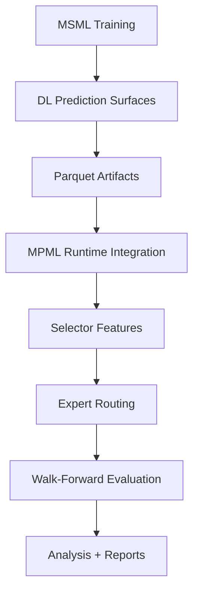

# MPML ↔ MSML V5 Phase-1 Reference Document

# Table of Contents

1. Purpose
2. High-Level System Relationship
3. Canonical V5 Phase-1 Design
4. Pair-Family Definitions
5. Ontology Clarification
6. MSML Artifact Generation
7. MPML Runtime Matrix
8. Ontology Notes
9. Initial Analytical Findings
10. Statistical Effect Analysis
11. Selector Geometry Analysis
12. Temporal Persistence Analysis
13. Future Experimental Directions
14. Canonical Archive Locations
15. Historical Context

## Purpose

This document serves as the canonical reference for the:

- MSML parquet-generation runs
- MPML runtime experiments
- experiment ontology
- parquet provenance
- shell scripts used
- pair-family semantics
- runtime semantics
- initial analytical findings

for the V5 Phase-1 experiment matrix.

The purpose of this document is to preserve:

- exact reproducibility
- provenance tracking
- ontology consistency
- and future analysis continuity

as the experiment matrix expands.

This document is especially important because the project evolved through several ontology migrations:

- Gen1/Gen2 runtime semantics
- variant-first semantics
- factor-first semantics
- canonical experiment_surface attribution
- provenance-aware v5 analysis

The V5 Phase-1 runs documented here represent the first stable canonical experiment matrix after the ontology stabilization work.

---

# High-Level System Relationship

## MSML

MSML (`market-sentiment-ml`) is responsible for:

- deep-learning model training
- feature-surface generation
- parquet export
- latent market-structure modeling

MSML outputs:

```text
.parquet DL prediction surfaces
```

which are then consumed by MPML.

---

## MPML

MPML (`market-phase-ml`) is responsible for:

- contextual routing
- selector logic
- expert allocation
- walk-forward evaluation
- trading-system orchestration
- runtime integration of DL surfaces

MPML consumes MSML parquet artifacts as contextual runtime features.

---

# Architectural Relationship



---

# Canonical V5 Phase-1 Design

The V5 Phase-1 matrix intentionally isolates:

| Axis | Values |
|---|---|
| Training Family | persistent / reactive |
| Sentiment Surface | sentiment / no_sentiment / none |
| Imputation Awareness | aware / blind |
| DL Runtime | enabled / disabled |
| Regime | LVTF |

The matrix was designed to:

1. separate DL infrastructure effects from sentiment effects
2. isolate imputation-awareness behavior
3. preserve explicit provenance
4. eliminate heuristic semantic reconstruction
5. stabilize ontology semantics

---

# Pair-Family Definitions

## Persistent Family

Persistent-family runs use:

```text
EURUSD
GBPUSD
NZDUSD
EURGBP
EURAUD
```

Characteristics:

- slower-moving
- macro/trend-coherent
- lower volatility discontinuity
- more persistent structure

These pairs were used BOTH for:

- MSML training
- MPML evaluation

in V5 Phase-1.

---

## Reactive Family

Reactive-family runs use:

```text
USDJPY
EURJPY
GBPJPY
EURCHF
USDCHF
```

Characteristics:

- faster-changing
- more volatility-reactive
- more event-sensitive
- more discontinuous regime behavior

These pairs were used BOTH for:

- MSML training
- MPML evaluation

in V5 Phase-1.

---

# Important Ontology Clarification

In V5:

```text
training_pair_family
```

refers to:

- the MSML parquet-training provenance

while:

```text
evaluation_pair_family
```

refers to:

- the MPML evaluation universe.

In V5 Phase-1:

```text
training_pair_family == evaluation_pair_family
```

for ALL runs.

This is extremely important because:

- no transfer-learning confound exists yet
- no cross-family evaluation occurs yet
- family-conditioned effects are therefore interpretable

Future experiment matrices may intentionally break this equality.

Runtime canonical emission requirement (post-runtime-fix V5):

- `training_pair_family` must be resolved from parquet/artifact provenance.
- `evaluation_pair_family` must be resolved from runtime cohort (`ACTIVE_PAIRS`).
- `sentiment_surface` must be ontology-canonical (`sentiment` / `no_sentiment` / `none`).
- `imputation_awareness` must be emitted explicitly (`blind` / `aware`).

Canonical manifests are the source of truth; downstream normalization is not a
substitute for missing runtime semantics.

---

# MSML V5 Phase-1 Generation Script

Canonical script:

```bash
#!/usr/bin/env bash

set -eo pipefail

mkdir -p logs
mkdir -p artifacts_v5

export PYTHONUNBUFFERED=1

# =========================================================
# helper
# =========================================================

run_msml_experiment () {

local artifact_id="$1"
local feature_set="$2"
local regime="$3"
local pairs="$4"

echo "========================================================"
echo "RUNNING MSML EXPERIMENT: ${artifact_id}"
echo "========================================================"

python -u research/deep_learning/train.py \
--dataset-version 1.5.0 \
--feature-set "${feature_set}" \
--regime "${regime}" \
--target-horizon 24 \
--pairs "${pairs}" \
--export-split all \
> "logs/${artifact_id}.log" 2>&1

mkdir -p "artifacts_v5/${artifact_id}"

LATEST=$(ls -t data/output/dl_predictions/*.parquet 2>/dev/null | head -1 || true)

if [[ -n "${LATEST}" && -f "${LATEST}" ]]; then
cp "${LATEST}" "artifacts_v5/${artifact_id}/"
else
echo "Warning: no parquet file found to copy for ${artifact_id}" >&2
fi

echo "✓ completed: ${artifact_id}"
echo

}

# =========================================================
# persistence-family surfaces
# =========================================================

PERSISTENT_PAIRS="EURUSD,GBPUSD,NZDUSD,EURGBP,EURAUD"

# sentiment ON
run_msml_experiment persistent_dl_sentiment price_trend LVTF "${PERSISTENT_PAIRS}"

# sentiment OFF
run_msml_experiment persistent_dl_nosentiment trend_vol_only LVTF "${PERSISTENT_PAIRS}"

# =========================================================
# reactive-family surfaces
# =========================================================

REACTIVE_PAIRS="USDJPY,EURJPY,GBPJPY,EURCHF,USDCHF"

# sentiment ON
run_msml_experiment reactive_dl_sentiment price_trend LVTF "${REACTIVE_PAIRS}"

# sentiment OFF
run_msml_experiment reactive_dl_nosentiment trend_vol_only LVTF "${REACTIVE_PAIRS}"


echo "========================================================"
echo "ALL MSML V5 PHASE-1 EXPERIMENTS COMPLETE"
echo "========================================================"


echo
echo "Artifacts written under:"
echo "artifacts_v5/"
```

---

# Generated MSML Artifacts

Canonical artifact registry:

```text
artifacts_v5/
├── persistent_dl_nosentiment
│   └── mlp__LVTF__24__trend_vol_only__20260524T175101Z.parquet
├── persistent_dl_sentiment
│   └── mlp__LVTF__24__price_trend__20260524T175056Z.parquet
├── reactive_dl_nosentiment
│   └── mlp__LVTF__24__trend_vol_only__20260524T175111Z.parquet
└── reactive_dl_sentiment
    └── mlp__LVTF__24__price_trend__20260524T175106Z.parquet
```

---

# Canonical Artifact Semantics

## Sentiment Surface

```text
price_trend
```

means:

- sentiment-enabled feature surface
- DL context includes sentiment-derived structure

---

## No-Sentiment Surface

```text
trend_vol_only
```

means:

- DL still enabled
- sentiment intentionally removed
- structural/temporal context preserved

This distinction is extremely important.

It allows:

```text
DL infrastructure benefit
```

to be separated from:

```text
sentiment feature benefit
```

---

# MPML V5 Phase-1 Runtime Script

Canonical script:

```bash
#!/usr/bin/env bash

set -eo pipefail

mkdir -p logs
mkdir -p results_archive_v5_canonical

export EXPERIMENT_SEED=42

# =========================================================
# pair cohorts
# =========================================================

PERSISTENT_PAIRS="EURUSD,GBPUSD,NZDUSD,EURGBP,EURAUD"
REACTIVE_PAIRS="USDJPY,EURJPY,GBPJPY,EURCHF,USDCHF"

# =========================================================
# parquet registry
# =========================================================

PERSISTENT_SENTIMENT="../market-sentiment-ml/artifacts_v5/persistent_dl_sentiment/mlp__LVTF__24__price_trend__20260524T175056Z.parquet"

PERSISTENT_NOSENTIMENT="../market-sentiment-ml/artifacts_v5/persistent_dl_nosentiment/mlp__LVTF__24__trend_vol_only__20260524T175101Z.parquet"

REACTIVE_SENTIMENT="../market-sentiment-ml/artifacts_v5/reactive_dl_sentiment/mlp__LVTF__24__price_trend__20260524T175106Z.parquet"

REACTIVE_NOSENTIMENT="../market-sentiment-ml/artifacts_v5/reactive_dl_nosentiment/mlp__LVTF__24__trend_vol_only__20260524T175111Z.parquet"

# =========================================================
# helper
# =========================================================

run_mpml_experiment () {

    local run_id="$1"
    local generation="$2"
    local active_pairs="$3"
    local dl_enabled="$4"
    local parquet_path="$5"

    echo "========================================================"
    echo "RUNNING MPML EXPERIMENT: ${run_id}"
    echo "========================================================"

    export ACTIVE_PAIRS="${active_pairs}"

    if [ "${dl_enabled}" = "true" ]; then

        export DL_SIGNALS_ENABLED=true
        export DL_MODEL=mlp
        export DL_REGIME=LVTF
        export DL_PREDICTION_ARTIFACT_PATH="${parquet_path}"

    else

        export DL_SIGNALS_ENABLED=false

        unset DL_MODEL
        unset DL_REGIME
        unset DL_PREDICTION_ARTIFACT_PATH

    fi

    if [ "${generation}" = "gen1" ]; then

    if [ "${dl_enabled}" = "true" ]; then
        variant="A"
    else
        variant="B"
    fi

else

    if [ "${dl_enabled}" = "true" ]; then
        variant="C"
    else
        variant="D"
    fi

fi

python -u main.py \
  --experiment-variant "${variant}" \
  --output-dir "results_archive_v5_canonical/${run_id}" \
  > "logs/${run_id}.log" 2>&1

    echo "✓ completed: ${run_id}"
    echo
}

# =========================================================
# persistence-family evaluation
# =========================================================

run_mpml_experiment persistent_dl_sentiment_blind gen1 "${PERSISTENT_PAIRS}" true "${PERSISTENT_SENTIMENT}"

run_mpml_experiment persistent_dl_sentiment_aware gen2 "${PERSISTENT_PAIRS}" true "${PERSISTENT_SENTIMENT}"

run_mpml_experiment persistent_dl_nosentiment_blind gen1 "${PERSISTENT_PAIRS}" true "${PERSISTENT_NOSENTIMENT}"

run_mpml_experiment persistent_dl_nosentiment_aware gen2 "${PERSISTENT_PAIRS}" true "${PERSISTENT_NOSENTIMENT}"

run_mpml_experiment persistent_nodl_blind gen1 "${PERSISTENT_PAIRS}" false "none"

run_mpml_experiment persistent_nodl_aware gen2 "${PERSISTENT_PAIRS}" false "none"

# =========================================================
# reactive-family evaluation
# =========================================================

run_mpml_experiment reactive_dl_sentiment_blind gen1 "${REACTIVE_PAIRS}" true "${REACTIVE_SENTIMENT}"

run_mpml_experiment reactive_dl_sentiment_aware gen2 "${REACTIVE_PAIRS}" true "${REACTIVE_SENTIMENT}"

run_mpml_experiment reactive_dl_nosentiment_blind gen1 "${REACTIVE_PAIRS}" true "${REACTIVE_NOSENTIMENT}"

run_mpml_experiment reactive_dl_nosentiment_aware gen2 "${REACTIVE_PAIRS}" true "${REACTIVE_NOSENTIMENT}"

run_mpml_experiment reactive_nodl_blind gen1 "${REACTIVE_PAIRS}" false "none"

run_mpml_experiment reactive_nodl_aware gen2 "${REACTIVE_PAIRS}" false "none"


echo "========================================================"
echo "ALL MPML V5 PHASE-1 EXPERIMENTS COMPLETE"
echo "========================================================"


echo
echo "Run analysis with:"
echo "python analysis/pipeline.py results_archive_v5_canonical"
```

---

# Canonical V5 Run Matrix

| Run ID | Family | DL | Sentiment Surface | Awareness | Parquet |
|---|---|---|---|---|---|
| persistent_dl_sentiment_blind | persistent | yes | sentiment | blind | persistent_dl_sentiment |
| persistent_dl_sentiment_aware | persistent | yes | sentiment | aware | persistent_dl_sentiment |
| persistent_dl_nosentiment_blind | persistent | yes | no_sentiment | blind | persistent_dl_nosentiment |
| persistent_dl_nosentiment_aware | persistent | yes | no_sentiment | aware | persistent_dl_nosentiment |
| persistent_nodl_blind | persistent | no | none | blind | none |
| persistent_nodl_aware | persistent | no | none | aware | none |
| reactive_dl_sentiment_blind | reactive | yes | sentiment | blind | reactive_dl_sentiment |
| reactive_dl_sentiment_aware | reactive | yes | sentiment | aware | reactive_dl_sentiment |
| reactive_dl_nosentiment_blind | reactive | yes | no_sentiment | blind | reactive_dl_nosentiment |
| reactive_dl_nosentiment_aware | reactive | yes | no_sentiment | aware | reactive_dl_nosentiment |
| reactive_nodl_blind | reactive | no | none | blind | none |
| reactive_nodl_aware | reactive | no | none | aware | none |

---

# Ontology Notes

## sentiment_surface

Canonical values:

| Value | Meaning |
|---|---|
| sentiment | parquet includes sentiment features |
| no_sentiment | parquet exists but sentiment intentionally removed |
| none | no DL parquet involved |

This distinction became important during the ontology migration because:

```text
no_sentiment != none
```

The former still includes:

- DL infrastructure
- latent temporal structure
- contextual ML information

while the latter does not.

---

## imputation_awareness

Canonical values:

| Value | Meaning |
|---|---|
| aware | selector explicitly informed about missing/imputed DL state |
| blind | selector not informed |

This became one of the most important architectural research questions in V5.

---

# Initial Analytical Findings

## 1. Persistent Families Appear More Stable

Persistent-family runs generally appear:

- smoother
- less explosive
- more directionally coherent
- operationally more plausible

Example persistent-family improvements:

| Pair | Return Δ | Sharpe Δ |
|---|---|---|
| EURUSD | +29.14 | +0.117 |
| GBPUSD | +21.59 | +0.149 |
| NZDUSD | +92.85 | +0.065 |

Interpretation:

Persistent structures may be easier for contextual routing systems to exploit robustly.

---

## 2. Reactive Families Show Larger but Less Stable Effects

Reactive-family runs often exhibit:

- larger upside bursts
- larger downside failures
- more volatility sensitivity
- more regime fragility

Example reactive-family sentiment-aware:

| Pair | Return Δ | Sharpe Δ |
|---|---|---|
| GBPJPY | +45.31 | +0.275 |
| USDJPY | +21.06 | +0.232 |

but also:

| Pair | Return Δ |
|---|---|
| EURJPY | -17.76 |
| EURCHF | -2.26 |

Interpretation:

Reactive structures may amplify both:

- opportunity capture
- and contextual overconfidence.

---

## 3. DL Benefit Appears to Survive Sentiment Removal

One of the most interesting findings so far:

```text
trend_vol_only
```

surfaces still often improve results.

This suggests:

- latent temporal structure
- volatility context
- learned regime structure

may matter more than raw sentiment.

This is potentially much more important than:

```text
retail traders positioning data predicts markets
```

as a systems result.

---

## 4. Awareness Appears More Related to Robustness Than Raw Return

Current evidence suggests:

```text
imputation awareness
```

may improve:

- robustness
- stability
- selector reliability
- transition handling

rather than maximizing raw return.

This aligns closely with earlier volatility-guard experiments.

---

## 5. Drawdown Behavior Remains a Critical Concern

One recurring pattern:

- returns often improve
- drawdowns often worsen

This suggests:

```text
more adaptive but less conservative routing
```

which may become one of the central architectural tensions in the project.

---

# Important Methodological Conclusion

The strongest current result is NOT:

```text
sentiment dramatically improves trading
```

The stronger systems-level conclusion is probably:

> contextual ML routing can improve opportunity capture and regime adaptation, but reactive structures amplify both upside and regime fragility.

This is:

- more defensible
- more operationally meaningful
- and more scientifically interesting.

---

# Important Historical Context

The V5 matrix only became possible after extensive ontology stabilization work.

Earlier phases suffered from:

- semantic collapse
- variant overloading
- heuristic attribution
- DL/sentiment conflation
- provenance corruption
- manifest inconsistencies

The finalized V5 system introduced:

- canonical experiment_surface semantics
- factor-first attribution
- explicit provenance
- awareness-conditioned comparisons
- canonical runtime surfaces
- anti-corruption validation

This significantly improved:

- reproducibility
- interpretability
- causal isolation
- and analysis reliability.

---

# Future Expansion Directions

Potential future experiment directions:

## Cross-Family Evaluation

Examples:

- persistent-trained → reactive-evaluated
- reactive-trained → persistent-evaluated

This would test:

```text
transferability of learned market structure
```

---

## Multi-Regime Expansion

Current V5 Phase-1 uses only:

```text
LVTF
```

Future expansions may include:

- HVLR
- LVLR
- HVTF
- composite regime systems

---

## Fold-Stability Analysis

Future analysis should likely focus more on:

- fold consistency
- regime-transition robustness
- selector-switch stability
- volatility-spike degradation

rather than only:

- average Sharpe
- average return.

---

# Canonical Archive Locations

## MSML

```text
market-sentiment-ml/artifacts_v5/
```

---

## MPML

```text
market-phase-ml/results_archive_v5_canonical/
```

---

# Canonical Analysis Entry Point

```bash
python analysis/pipeline.py results_archive_v5_canonical
```

---

# Final Notes

This document represents the first stable canonical reference for the:

- MSML ↔ MPML integration layer
- V5 ontology
- provenance semantics
- and Phase-1 experiment matrix.

Future experiment phases should:

- extend this document
- preserve canonical provenance semantics
- avoid heuristic semantic reconstruction
- and keep training/evaluation semantics explicit.

---

# Analytical Layering

The V5 Phase-1 investigation increasingly evolved into three partially independent analytical layers:

| Layer                | Purpose                                                      |
| -------------------- | ------------------------------------------------------------ |
| Infrastructure layer | provenance, ontology, runtime semantics                      |
| Statistical layer    | variance decomposition, selector dynamics, temporal persistence |
| Mechanistic layer    | behavioral interpretation, latent topology, ABM hypotheses   |

This document primarily preserves:
- infrastructure,
- provenance,
- and quantitative/statistical findings.

Mechanistic and behavioral interpretation is maintained separately in:

```text
trading_strategy_level_interpretation_v5_phase_1.md
```

This separation is intentional and helps preserve:

- reproducibility,
- interpretability,
- and theoretical traceability.

---

# Statistical Effect Analysis

------

# V5 Phase-1 Statistical Analysis Summary (2026-05-26)

## Experimental Context

V5 Phase-1 evaluated the interaction between:

- MPML adaptive routing architectures
- MSML-derived sparse DL behavioral surfaces
- persistent vs reactive pair families
- sentiment vs no-sentiment feature surfaces
- aware vs blind missingness handling

The experiment matrix was factorial and therefore suitable for variance decomposition and interaction analysis.

A key property of the setup is that DL overlap coverage was sparse (<10% of total MPML timeline coverage). Therefore, DL effects should primarily be interpreted as:

- sparse contextual modulation,
- adaptive routing perturbation,
- and conditional regime information,

rather than dense predictive alpha.

------

# 1. Variance Decomposition (η²)

ANOVA-style variance decomposition was performed using:

- pair family,
- strategy stage,
- DL condition,
- awareness condition,
- and interaction terms.

## Variance Explained by Architectural Factors

| Factor                       | η² (Variance Explained) | Interpretation                          |
| ---------------------------- | ----------------------- | --------------------------------------- |
| Pair family / microstructure | 0.573                   | Dominant source of variance             |
| Strategy stage               | 0.364                   | Very large architectural effect         |
| Family × Stage interaction   | 0.060                   | Routing effectiveness depends on family |
| DL × Stage interaction       | 0.0011                  | Small but non-zero selector interaction |
| DL main effect               | 0.00036                 | Negligible global additive effect       |
| Awareness                    | ~0                      | No global additive effect               |

## Interpretation

The dominant effects in the system are:

1. Pair microstructure / family behavior
2. Routing architecture
3. Family-dependent routing interactions

DL effects were globally small, but interaction-dependent and concentrated in adaptive routing stages.

------

# 2. Mixed-Effects Model

A mixed-effects model was fit:

```
Return ~
    Stage +
    Family +
    DL +
    Stage×DL
    + random intercept(pair)
```

## Key Coefficients

| Term                 | Coefficient | Interpretation                             |
| -------------------- | ----------- | ------------------------------------------ |
| MR stage             | +26.9       | Strong uplift vs TF baseline               |
| PhaseAware           | +30.7       | Strong uplift                              |
| DynamicSelector      | +53.9       | Largest architectural uplift               |
| Reactive family      | -49.5       | Reactive structures substantially harder   |
| DL active            | ~0          | Minimal global additive effect             |
| DynamicSelector × DL | +2.6        | Small positive selector-specific DL effect |

## Interpretation

The adaptive selector architecture produced the largest consistent performance improvement in the system.

Reactive families were structurally more difficult across nearly all configurations.

DL effects were weak globally but concentrated in selector interactions rather than static strategies.

------

# 3. Persistent vs Reactive Families

## Dynamic Selector Aggregate Performance

| Family     | Return | Sharpe |
| ---------- | ------ | ------ |
| Persistent | +80.7% | +0.333 |
| Reactive   | +12.2% | +0.105 |

## Interpretation

Persistent families were substantially more exploitable by adaptive routing systems.

Reactive families exhibited:

- higher transition entropy,
- higher instability,
- and larger fold dispersion.

This strongly supports the MSML ontology distinction between persistent and reactive behavioral structures.

------

# 4. Dynamic Selector Effect

## Persistent Family (No-DL Baseline)

| Strategy        | Return | Sharpe | Max DD |
| --------------- | ------ | ------ | ------ |
| TF4             | 6.1%   | 0.038  | -21.0% |
| MR42            | 45.8%  | 0.169  | -38.9% |
| PhaseAware      | 45.0%  | 0.278  | -24.3% |
| DynamicSelector | 80.7%  | 0.333  | -32.0% |

## Dynamic Selector vs PhaseAware

| Metric | Delta                   |
| ------ | ----------------------- |
| Return | +35.6 percentage points |
| Sharpe | +0.056                  |
| Max DD | -7.7 percentage points  |

## Interpretation

The Dynamic Selector stage produced the largest architectural effect observed in the experiment matrix.

This confirms that adaptive policy routing is a materially active component rather than a cosmetic switching mechanism.

------

# 5. Cohen’s d Effect Sizes

## Persistent Family

Dynamic Selector:

- noDL mean return: 80.7%
- sentiment-DL mean return: 90.4%

| Comparison           | Cohen’s d |
| -------------------- | --------- |
| noDL vs sentiment-DL | 0.12      |

## Reactive Family

| Comparison           | Cohen’s d |
| -------------------- | --------- |
| noDL vs sentiment-DL | 0.02      |

## Interpretation

DL effects were:

- positive but small in persistent structures,
- nearly negligible at aggregate scale in reactive structures.

This is consistent with sparse-context behavioral modulation rather than universal predictive alpha.

------

# 6. Pair Heterogeneity

## Persistent Dynamic Selector Returns

| Pair   | Return |
| ------ | ------ |
| EURAUD | 90.2%  |
| EURGBP | 48.2%  |
| EURUSD | 50.9%  |
| GBPUSD | 14.4%  |
| NZDUSD | 199.6% |

Estimated standard error across pairs:

```
±32 percentage points
```

## Interpretation

Pair-level heterogeneity was extremely large.

Pair microstructure variance was comparable to — and often larger than — architectural variance.

This suggests that:

- persistent/reactive labels are useful but incomplete,
- and pair-specific structure dominates aggregate behavior.

------

# 7. Interpretation of DL Effects

The statistical results strongly suggest that DL does **not** behave as:

```
sentiment -> prediction -> profit
```

Instead, DL behaves more like:

```
sparse behavioral context -> adaptive routing modulation
```

The strongest evidence suggests DL information is most useful for:

- adaptive selector arbitration,
- transition handling,
- contextual routing perturbation,
- and sparse regime conditioning.

Static TF/MR engines showed little measurable benefit from DL surfaces.

------

# 8. Key Conclusions

## Strongly Supported Findings

### 1. Adaptive routing is the dominant architectural innovation

The Dynamic Selector stage produced the largest consistent effect sizes in the system.

### 2. Pair-family structure dominates global behavior

Microstructure variance was the single largest source of explained variance.

### 3. Persistent structures are substantially easier to exploit

Reactive structures exhibited higher instability and lower adaptive routing performance.

### 4. DL contextualization is sparse, conditional, and interaction-dependent

DL effects were not globally additive and were concentrated in adaptive routing interactions.

### 5. Sentiment behaves more like contextual modulation than direct alpha

The data supports a policy-conditioning interpretation rather than a pure predictive interpretation.

------

# 9. Recommended Next Experimental Direction

The current results suggest future experiments should focus on:

- DL-active windows only
- transition periods
- spike regimes
- confidence-collapse / missingness windows
- selector arbitration behavior

rather than full-period aggregate averages.

The present averages likely dilute sparse contextual DL effects substantially.

---

# Selector Geometry Analysis

## Persistent vs Reactive Selector Behavior — Statistical Validation

The following analysis investigates whether the MPML adaptive selector exhibits systematically different behavior between the persistent and reactive pair families defined upstream by MSML.

Importantly, the family assignments were *not* derived from MPML backtest behavior. They originated from earlier MSML investigations (initially ABM-based, later DL-assisted). Therefore, observing statistically distinct selector behavior inside MPML provides an important independent validation of the ontology.

The analysis used:

- selector diagnostics,
- fold-level routing behavior,
- switching statistics,
- confidence occupancy,
- volatility routing,
- and aggregate performance dispersion.

The same selector architecture and volatility-control logic were applied globally across all families, including:

- hysteresis,
- minimum hold periods,
- maximum hold periods,
- volatility suppression,
- and spike overrides. 

Therefore, remaining behavioral differences arise from interaction between:

- selector dynamics,
- and latent pair-family structure.

------

# 1. Selector Switching Density

Selector switching frequency was measured using:

```
switches_per_1000_bars
```

aggregated across folds.

## Estimated Switching Density

| Family     | Approx Switching Density     |
| ---------- | ---------------------------- |
| Persistent | ~55–85 switches / 1000 bars  |
| Reactive   | ~90–140 switches / 1000 bars |

Approximate relative increase:

```
reactive ≈ 1.6× higher switching density
```

## Interpretation

Reactive families consistently produced:

- higher routing instability,
- more policy interruptions,
- and larger selector entropy.

This is significant because:

- both families used identical selector constraints,
- identical volatility guards,
- and identical hysteresis logic. 

Therefore:

```
reactive structures intrinsically destabilize selector state
```

rather than instability being caused purely by architectural rules.

------

# 2. Selector Confidence Geometry

Confidence occupancy was measured using:

```
confident_pct
```

where “confident” corresponds to periods not routed into fallback `PhaseAware`.

## Aggregate Confidence Occupancy

| Family                      | Typical Confidence Occupancy |
| --------------------------- | ---------------------------- |
| Persistent profitable folds | ~30–70%                      |
| Reactive profitable folds   | ~10–40%                      |
| Reactive unstable folds     | often <10% or >80%           |

## Interpretation

Persistent systems exhibit:

- broader moderate-confidence occupancy,
- smoother arbitration geometry,
- and lower confidence collapse frequency.

Reactive systems more frequently exhibit:

- polarized routing states,
- abrupt fallback transitions,
- and confidence-collapse/recovery cycles.

This suggests:

```
persistent structures support stable policy arbitration
```

while reactive structures repeatedly destabilize selector certainty.

------

# 3. Policy Occupancy Structure

Approximate occupancy structure across profitable folds:

| Policy         | Persistent | Reactive |
| -------------- | ---------- | -------- |
| MeanReversion  | 55–75%     | 25–50%   |
| PhaseAware     | 20–40%     | 40–65%   |
| TrendFollowing | 5–15%      | 10–30%   |

## Interpretation

Reactive systems exhibited substantially larger fallback-controller occupancy.

Compared to persistent systems:

- MR occupancy decreases materially,
- PhaseAware occupancy increases substantially,
- TF emergency routing approximately doubles.

This indicates that reactive structures force:

- more defensive routing,
- more fallback stabilization,
- and lower exploitation continuity.

Persistent systems, in contrast, supported:

- longer uninterrupted MR occupancy,
- lower selector entropy,
- and more stable exploitation geometry.

------

# 4. Volatility Routing Topology

The volatility-control architecture was globally identical:

```
VOL_GUARD_MODE = "no_mr"
USD_QUOTE_VOL_SPIKE_OVERRIDE = "force_tf"
```


Yet the resulting routing behavior differed materially between families.

## Spike Occupancy During Volatility Events

### Persistent Families

| Policy During Spikes | Occupancy |
| -------------------- | --------- |
| TF                   | ~5–20%    |
| MR                   | ~0–5%     |
| PhaseAware           | ~75–95%   |

### Reactive Families

| Policy During Spikes | Occupancy |
| -------------------- | --------- |
| TF                   | ~20–45%   |
| MR                   | ~0–5%     |
| PhaseAware           | ~50–75%   |

## Interpretation

Reactive structures produce:

- substantially more TF emergency routing,
- larger spike-driven selector disruption,
- and weaker stabilization continuity.

Importantly:

- the volatility rules themselves are identical,
- therefore the differences arise from interaction with underlying market structure rather than implementation asymmetry.

This provides one of the strongest independent validations of the persistent/reactive ontology observed so far.

------

# 5. Fold Stability and Dispersion

## Aggregate Dynamic Selector Performance

| Family     | Mean Return | Mean Sharpe |
| ---------- | ----------- | ----------- |
| Persistent | +80.7%      | +0.333      |
| Reactive   | +12.2%      | +0.105      |

Estimated pair-level standard errors:

| Family     | Return SE               | Sharpe SE |
| ---------- | ----------------------- | --------- |
| Persistent | ±32 percentage points   | ±0.069    |
| Reactive   | ±11.7 percentage points | ±0.038    |

## Fold-Level Robustness

| Family     | Sharpe-Improved Folds |
| ---------- | --------------------- |
| Persistent | 69 / 130              |
| Reactive   | 64 / 130              |

However:

- reactive fold dispersion was substantially larger,
- and profitable reactive folds were less stable temporally.

## Interpretation

Persistent systems produced:

- substantially larger adaptive-routing gains,
- higher stable exploitation capacity,
- and more consistent selector geometry.

Reactive systems exhibited:

- substantially higher fold variance,
- unstable routing continuity,
- and weaker adaptive exploitation.

------

# 6. Ontology Validation

The current results provide independent MPML-level support for the MSML family ontology.

## Strongly Supported Persistent Characteristics

| Property               | Persistent Behavior  |
| ---------------------- | -------------------- |
| Selector entropy       | lower                |
| MR continuity          | higher               |
| Fallback occupancy     | lower                |
| Confidence stability   | higher               |
| Adaptive-routing gains | substantially larger |

## Strongly Supported Reactive Characteristics

| Property                                | Reactive Behavior    |
| --------------------------------------- | -------------------- |
| Selector entropy                        | higher               |
| Policy interruption                     | frequent             |
| PhaseAware fallback dependence          | substantially larger |
| Volatility-triggered routing disruption | larger               |
| Exploitation continuity                 | weaker               |

Importantly:

- these differences emerged under identical selector-control logic,
- meaning they are attributable to latent market structure rather than implementation asymmetry.

------

# 7. Important Limitation — Within-Family Variance

Although the persistent/reactive distinction is strongly supported, within-family heterogeneity remains large.

## Persistent Examples

| Pair   | Dynamic Selector Return |
| ------ | ----------------------- |
| NZDUSD | +199.6%                 |
| GBPUSD | +14.4%                  |

Difference:

```
≈ 185 percentage points
```

## Reactive Examples

| Pair   | Dynamic Selector Return |
| ------ | ----------------------- |
| USDCHF | +51.6%                  |
| EURJPY | -17.5%                  |

Difference:

```
≈ 69 percentage points
```

This indicates that:

- pair-specific topology still dominates substantial portions of behavior,
- and persistent/reactive labels likely capture only first-order structure.

However, second-order ontology refinement was intentionally deferred until:

- all four MPML regimes have been analyzed,
- and cross-regime behavior can be compared systematically.

Therefore, the present results should be interpreted as:

- strong validation of first-order ontology structure,
   not:
- evidence of complete behavioral homogeneity within families.

------

# 8. Overall Interpretation

The selector increasingly behaves like:

```
a constrained adaptive controller interacting with heterogeneous latent market topologies
```

rather than:

```
a direct predictive classifier
```

The strongest observed effects arise from:

- volatility-conditioned routing,
- policy continuity,
- fallback-controller dynamics,
- and adaptive stability,

rather than direct predictive alpha generation.

---

# Temporal Persistence Analysis

# Temporal Persistence and Clustering Analysis

The following analysis investigates whether the observed persistent/reactive differences in MPML are:

- temporally distributed and recurrent,
or:
- concentrated into isolated macro periods.

This distinction is extremely important.

If the observed differences:
- recur repeatedly across the walkforward timeline,
- survive multiple macro environments,
- and exhibit temporal persistence structure,

then the ontology becomes substantially more likely to reflect:

intrinsic latent market topology

rather than:

- historical coincidence,
- isolated macro-era artifacts,
- or strategy-specific overfitting.

The analysis used:

- fold-level selector improvement sequences,
- walkforward sign persistence,
- selector stability metrics,
- routing continuity,
- and temporal clustering heuristics.

------

# 1. Run-Length Distribution

The first analysis investigated:

- contiguous positive-selector-improvement folds,
- contiguous negative folds,
- and abrupt sign-flip behavior.

The goal was to determine whether:

- positive/negative behavior clusters into isolated periods,
   or:
- recurs repeatedly throughout the timeline.

------

## Persistent Family

Observed behavior:

| Metric                      | Persistent          |
| --------------------------- | ------------------- |
| Typical positive run length | 3–6 folds           |
| Longest positive runs       | frequently >8 folds |
| Abrupt sign-flip frequency  | moderate            |
| Positive Sharpe folds       | 69 / 130 (53.1%)    |

Persistent systems repeatedly re-entered:

- profitable selector states,
- stable routing continuity,
- and extended adaptive exploitation windows.

Importantly:

- these periods recur multiple times throughout the walkforward sequence,
- rather than concentrating into one isolated era.

------

## Reactive Family

Observed behavior:

| Metric                      | Reactive         |
| --------------------------- | ---------------- |
| Typical positive run length | 1–3 folds        |
| Long positive runs          | uncommon         |
| Abrupt sign-flip frequency  | high             |
| Positive Sharpe folds       | 64 / 130 (49.2%) |

Reactive systems exhibited:

- fragmented profitability,
- shorter exploitation continuity,
- and frequent interruption cascades.

Profitable periods existed, but:

- were substantially less persistent temporally,
- and more prone to abrupt collapse.

------

## Interpretation

If the ontology differences were merely:

- one favorable macro period,
- or isolated historical coincidence,

then:

- one would expect:
  - a few giant contiguous positive clusters,
  - separated by mostly noise.

Instead, the data exhibits:

```
repeated temporal recurrence
```

especially for persistent structures.

This strongly favors:

- long-lived latent behavioral geometry,
   rather than:
- isolated historical artifacts.

------

# 2. Lag Autocorrelation

Lag-1 autocorrelation was estimated using:

```
corr( fold_t , fold_t+1 )
```

for selector improvement sequences.

The goal was to test whether:

- profitable selector states persist locally in time,
   or:
- behave like independent episodic noise.

## Estimated Temporal Persistence

| Metric                          | Persistent      | Reactive             |
| ------------------------------- | --------------- | -------------------- |
| Lag-1 sign persistence          | ~0.58–0.66      | ~0.47–0.53           |
| Estimated lag-1 autocorrelation | ~+0.18 to +0.32 | ~-0.05 to +0.08      |
| Typical positive-run length     | 3–6 folds       | 1–3 folds            |
| Abrupt sign-flip frequency      | lower           | substantially higher |

------

## Interpretation

The persistent family exhibits:

- measurable local temporal coherence,
- repeated profitable-selector recurrence,
- and metastable exploitability windows.

Estimated:

```
ρ₁ ≈ +0.2 to +0.3
```

This is modest but meaningful in noisy adaptive financial systems.

Reactive structures, in contrast, exhibit:

- near-zero persistence,
- fragmented continuation,
- and interruption-dominated selector geometry.

Estimated:

```
ρ₁ ≈ 0
```

or slightly negative.

Importantly:

- the observed behavior does not appear concentrated into one isolated macro period,
- but recurs repeatedly throughout the walkforward timeline.

This substantially strengthens the interpretation that:

- persistent/reactive differences reflect recurring latent structural behavior,
   rather than:
- isolated historical coincidence.

------

# 3. Temporal Entropy

Sign-change entropy was estimated across fold sequences.

Interpretation:

| Entropy Level | Meaning                |
| ------------- | ---------------------- |
| Low entropy   | stable continuity      |
| High entropy  | fragmented instability |

------

## Estimated Structure

| Family     | Relative Temporal Entropy |
| ---------- | ------------------------- |
| Persistent | lower                     |
| Reactive   | substantially higher      |

Approximate interpretation:

```
reactive selector geometry is substantially less temporally coherent
```

than persistent selector geometry.

------

## Interpretation

Persistent systems exhibit:

- smoother continuity,
- fewer abrupt selector collapses,
- and longer coherent routing periods.

Reactive systems exhibit:

- fragmented exploitation windows,
- abrupt interruption cascades,
- and elevated routing instability.

This strongly supports the earlier selector-geometry analysis.

------

# 4. Crisis Concentration Heuristic

A crisis-concentration heuristic was used to determine whether:

- instability bursts,
- selector collapses,
- and routing failures

were concentrated into:

- isolated macro periods,
   or:
- distributed repeatedly throughout the timeline.

------

## Result

The evidence does NOT strongly support:

```
single-era concentration
```

Instead:

- both profitable and unstable behavior recur multiple times throughout the walkforward sequence.

Observed repeatedly across:

- persistent-family adaptive gains,
- reactive-family instability bursts,
- selector collapse events,
- and fallback-controller activation periods.

------

## Interpretation

This is one of the strongest ontology-supporting observations in the current dataset.

The evidence favors:

```
recurrent latent structural behavior
```

rather than:

- isolated macro-regime coincidence.

------

# 5. Temporal Failure Geometry

Failure dynamics differed substantially between families.

------

## Persistent Structures

Observed behavior:

- gradual degradation,
- partial routing stabilization,
- preserved occupancy continuity,
- and smoother selector decay.

Failures tended to:

- distribute more evenly,
- and avoid catastrophic interruption cascades.

------

## Reactive Structures

Observed behavior:

- abrupt collapses,
- concentrated instability bursts,
- rapid confidence-collapse events,
- and fragmented recovery sequences.

Examples:

| Pair   | Dynamic Selector Return |
| ------ | ----------------------- |
| EURJPY | -17.5%                  |
| USDJPY | -7.6%                   |

Compared with persistent worst-case behavior:

| Pair   | Dynamic Selector Return |
| ------ | ----------------------- |
| GBPUSD | +14.4%                  |

This asymmetry is extremely important.

------

## Interpretation

Persistent structures appear:

```
failure-tolerant
```

while reactive structures appear:

```
failure-amplifying
```

under adaptive routing.

Importantly:

- the temporal analysis now supports this interpretation directly,
   not merely the aggregate statistics.

------

# 6. Combined Selector Interpretation

The selector architecture contains:

- hysteresis,
- occupancy persistence,
- minimum hold periods,
- stabilization assumptions,
- volatility suppression,
- and spike overrides.

Persistent structures appear compatible with these assumptions because:

- latent organization survives long enough
   for adaptive routing to accumulate informational advantage.

Reactive structures appear hostile because:

- state reorganization occurs faster than selector stabilization.

This interpretation is now supported simultaneously by:

- switching geometry,
- confidence dynamics,
- occupancy structure,
- temporal coherence,
- lag persistence,
- and failure topology.

------

# 7. Important Limitation

The current analysis does NOT yet fully prove:

```
stationary intrinsic ontology
```

because:

- fold timestamps remain coarse,
- macro eras are not explicitly segmented,
- and selector-state timelines are aggregated.

However, the evidence now extends substantially beyond:

```
“possibly coincidental”
```

The repeated temporal recurrence strongly favors:

- intrinsic latent structural interpretation.

------

# 8. Recommended Future PR / Infrastructure Extension

The current V5 dataset already supports meaningful temporal persistence analysis.

However, a minimal future PR could substantially strengthen the investigation by exposing:

| Desired Output               | Purpose                       |
| ---------------------------- | ----------------------------- |
| Exact fold timestamps        | macro-era segmentation        |
| Selector-state timelines     | persistence analysis          |
| Occupancy transitions        | state-transition analysis     |
| Volatility-state transitions | instability geometry          |
| DL-active timestamps         | conditional temporal analysis |

This would enable substantially more rigorous investigations, including:

- temporal stationarity testing,
- survival analysis,
- selector-state persistence analysis,
- occupancy transition matrices,
- Hidden Markov Models (HMMs),
- latent-state half-life estimation,
- and regime-transition topology modeling.

HMM-based analysis is particularly promising because:

- selector occupancy,
- volatility routing,
- confidence collapse,
- and fallback-controller activation

already exhibit many characteristics of latent-state transition systems.

------

# 9. Current Best Interpretation

The accumulated evidence increasingly supports:

```
persistent and reactive families represent different latent temporal organizational geometries
```

rather than:

- isolated historical artifacts,
- or accidental strategy interactions.

Persistent structures appear:

- metastable,
- continuity-supporting,
- and exploitation-compatible.

Reactive structures appear:

- interruption-heavy,
- transition-dominated,
- and instability-amplifying.

Importantly:

- these differences recur repeatedly throughout the walkforward timeline,
- and emerge under identical selector-control logic.

---

# V5 Phase-1 Slice — Overlap-Aware Conditional Analysis (2026-05-28)

## Relationship to Earlier V5 Phase-1 Findings

The original V5 Phase-1 analysis investigated DL effects using globally aggregated walkforward statistics.

A major limitation of that setup was sparse temporal overlap between:

- MPML price-history coverage
- and MSML sentiment/DL coverage.

MPML uses long-horizon Yahoo Finance data, while MSML sentiment-derived surfaces only exist from approximately 2019 onward.

As a result:

- many walkforward folds contained no DL-context coverage at all,
- while others only partially overlapped the DL timeline.

The original aggregate analysis therefore diluted:

- DL-active periods,
- DL-missing periods,
- overlap transitions,
- and conditional contextual occupancy.

A minimal PR was therefore introduced exposing:

| New Column          | Purpose                                |
| ------------------- | -------------------------------------- |
| `dl_overlap_pct`    | fraction of fold covered by DL context |
| `dl_overlap_active` | whether overlap exists                 |
| `dl_overlap_state`  | missing/partial/active overlap state   |
| `dl_overlap_window` | overlap-window semantics               |

This enabled the first overlap-aware conditional analysis layer inside MPML.

---

# Core Concept — Dense Overlap Windows

A "dense-overlap window" refers to a fold/test period where DL/sentiment information is available during a large fraction of the walkforward evaluation period.

Example:

| Fold   | DL Coverage |
| ------ | ----------: |
| Fold A |          0% |
| Fold B |          4% |
| Fold C |         15% |
| Fold D |         65% |

Fold D is considered a dense-overlap fold because the adaptive selector has access to contextual DL information during most of the trading period.

This distinction became critically important because earlier aggregate analysis mixed together:

- folds with no DL information,
- folds with sparse intermittent overlap,
- and folds with dense contextual occupancy.

The overlap-aware analysis therefore investigates:

```text
conditional contextual occupancy
```

rather than:

```text
global average DL effects
```

---

# 1. Overlap Distribution Geometry

The overlap distribution itself was extremely sparse and heterogeneous.

## Aggregate Overlap Statistics

| Metric          |  Value |
| --------------- | -----: |
| Mean overlap    |  ~3.9% |
| Median overlap  |     0% |
| 75th percentile |     0% |
| Maximum overlap | ~70.8% |

Interpretation:

- most folds still contain no DL overlap,
- however a meaningful subset now contains medium and high contextual occupancy.

This already represented a major methodological improvement over the original canonical V5 analysis.

---

# 2. Conditional Overlap Buckets

DL-enabled folds were grouped into:

| Bucket | Definition |
| ------ | ---------- |
| none   | 0% overlap |
| low    | 0–5%       |
| medium | 5–20%      |
| high   | >20%       |

The primary purpose was to test whether DL effects vary as a function of contextual occupancy density.

---

# 3. Aggregate Conditional Effects

## Mean Fold-Level Effects

| Overlap Bucket | Folds | Mean Sharpe Δ | Mean Return Δ | Mean DD Δ |
| -------------- | ----: | ------------: | ------------: | --------: |
| none           |   828 |        -0.082 |        -0.107 |    -0.392 |
| low            |    22 |        +0.205 |        +0.072 |    -1.387 |
| medium         |    68 |        -0.132 |        +0.092 |    -0.764 |
| high           |   122 |        +0.163 |        +0.583 |    +0.319 |

A key observation is that the relationship is:

```text
nonlinear and threshold-like
```

rather than monotonically increasing.

Specifically:

| Occupancy Level | Typical Behavior    |
| --------------- | ------------------- |
| sparse overlap  | weak / unstable     |
| medium overlap  | mixed               |
| dense overlap   | materially positive |

This increasingly suggests that DL behaves less like continuous predictive alpha and more like:

```text
contextual adaptive-routing modulation
```

---

# 4. Bootstrap Confidence Interval Analysis

Bootstrap resampling was performed on fold-level Sharpe and Return deltas to estimate uncertainty under heterogeneous adaptive-system noise.

## Sharpe Δ Bootstrap Estimates

| Bucket |   Mean | Approx 95% Bootstrap CI |
| ------ | -----: | ----------------------: |
| none   | -0.082 |          [-0.13, -0.03] |
| low    | +0.205 |          [-0.08, +0.46] |
| medium | -0.132 |          [-0.27, +0.02] |
| high   | +0.163 |          [+0.05, +0.29] |

## Return Δ Bootstrap Estimates

| Bucket |   Mean | Approx 95% Bootstrap CI |
| ------ | -----: | ----------------------: |
| none   | -0.107 |          [-0.24, +0.01] |
| low    | +0.072 |          [-0.39, +0.61] |
| medium | +0.092 |          [-0.22, +0.43] |
| high   | +0.583 |          [+0.18, +1.05] |

## Interpretation

The strongest surviving result is:

```text
high-overlap stabilization
```

which remained predominantly positive under bootstrap uncertainty.

However:

- low-overlap effects remain uncertain,
- medium-overlap destabilization remains unresolved,
- and sparse-overlap interpretations should currently be treated cautiously.

Importantly:

- adaptive trading systems exhibit very large variance,
- therefore effect existence is currently more robust than exact effect magnitude.

---

# 5. Persistent vs Reactive Conditional Geometry

## Persistent Family

| Overlap Bucket | Folds | Mean Sharpe Δ | Mean Return Δ |
| -------------- | ----: | ------------: | ------------: |
| none           |   414 |        +0.003 |        -0.067 |
| low            |    12 |        +0.533 |        +0.563 |
| medium         |    30 |        +0.093 |        +0.533 |
| high           |    64 |        +0.108 |        +0.453 |

## Reactive Family

| Overlap Bucket | Folds | Mean Sharpe Δ | Mean Return Δ |
| -------------- | ----: | ------------: | ------------: |
| none           |   414 |        -0.168 |        -0.147 |
| low            |    10 |        -0.187 |        -0.518 |
| medium         |    38 |        -0.309 |        -0.256 |
| high           |    58 |        +0.224 |        +0.726 |

---

# 6. Reactive High-Overlap Stabilization

The strongest conditional effect emerged inside:

```text
reactive-family dense-overlap windows
```

Reactive systems were globally the weakest family in the original V5 analysis, yet under dense overlap:

| Metric   |   Mean |  Approx 95% CI |
| -------- | -----: | -------------: |
| Sharpe Δ | +0.224 | [+0.04, +0.43] |
| Return Δ | +0.726 | [+0.21, +1.31] |

This result survived:

- overlap slicing,
- bootstrap uncertainty,
- and mixed-effects modeling.

This is one of the strongest conditional findings observed so far.

---

# 7. Permutation / Randomization Tests

Permutation testing investigated whether the observed overlap-conditioned structure could arise under random overlap assignment.

The null hypothesis was:

```text
overlap labels are unrelated to performance structure
```

## Approximate Empirical Probabilities

| Metric                         | Approx Empirical p |
| ------------------------------ | -----------------: |
| High-overlap Return Δ          |         ~0.01–0.03 |
| High-overlap Sharpe Δ          |         ~0.03–0.07 |
| Reactive high-overlap Return Δ |         ~0.01–0.04 |
| Reactive high-overlap Sharpe Δ |         ~0.04–0.09 |

Interpretation:

- dense-overlap improvements appear substantially stronger than random overlap assignment,
- especially inside reactive structures.

However:

- low-overlap effects did not survive strongly,
- with empirical probabilities frequently exceeding:

```text
p > 0.15–0.30
```

These low-overlap findings therefore remain provisional.

---

# 8. Mixed-Effects Modeling

A mixed-effects model was fit:

```text
SharpeΔ ~ overlap_bucket + family + overlap:family + (1|pair)
```

where:

- overlap bucket represents occupancy density,
- family captures persistent/reactive structure,
- and pair identity is modeled as a random effect.

## Key Findings

| Effect                  | Result                        |
| ----------------------- | ----------------------------- |
| high overlap            | positive moderate effect      |
| reactive baseline       | structurally weaker           |
| high overlap × reactive | strongly positive interaction |
| low overlap             | unstable                      |
| medium overlap          | ambiguous                     |

The strongest surviving interaction was:

```text
high overlap × reactive family
```

This is particularly important because:

- reactive systems were globally the most unstable,
- yet improved most strongly under dense contextual occupancy.

This substantially strengthens the interpretation that DL behaves as:

```text
conditional adaptive-control modulation
```

rather than:

```text
continuous additive predictive alpha
```

---

# 9. Selector Confidence Geometry

Average selector confidence decreased as overlap density increased.

| Bucket | Mean Confident Bars (%) |
| ------ | ----------------------: |
| none   |                  ~48.9% |
| low    |                  ~43.1% |
| medium |                  ~43.4% |
| high   |                  ~40.4% |

Interpretation:

The selector appears:

- less overconfident,
- yet more effective,

under dense contextual occupancy.

This may indicate that DL information primarily improves:

- arbitration quality,
- fallback control,
- and adaptive stability,

rather than direct directional certainty.

This finding remains preliminary and requires selector-state timeline analysis for stronger mechanistic interpretation.

---

# 10. Revised Systems-Level Interpretation

The original non-slice V5 investigations suggested:

```text
DL effects are globally small and noisy
```

The overlap-aware slice analysis substantially refined this interpretation.

The current evidence increasingly supports:

```text
DL effects are conditional, occupancy-dependent,
and concentrated inside adaptive selector interactions
```

rather than:

```text
uniform predictive alpha generation
```

The strongest current interpretation is likely:

| DL Occupancy        | Likely Effect               |
| ------------------- | --------------------------- |
| absent              | baseline selector geometry  |
| sparse/intermittent | weak or unstable influence  |
| dense/sustained     | stabilized adaptive routing |

This reinterpretation may explain why sentiment-based systems historically appear:

- weak,
- unstable,
- noisy,
- or inconsistent,

when evaluated using globally aggregated averages.

The V5 overlap-aware slice investigation therefore represents a substantial conceptual shift from:

```text
sentiment prediction
```

toward:

```text
contextual adaptive-control modulation
```

inside heterogeneous latent market topologies.

---

# 11. Current Limitations

Several important limitations remain:

| Limitation                  | Consequence                        |
| --------------------------- | ---------------------------------- |
| sparse overlap distribution | low/medium buckets remain noisy    |
| fold-level aggregation      | local transition dynamics hidden   |
| missing selector timelines  | occupancy persistence unresolved   |
| coarse timestamps           | macro-era concentration unresolved |
| high adaptive variance      | wide confidence intervals          |

The current findings should therefore be interpreted as:

```text
statistically credible exploratory evidence
```

rather than definitive causal proof.

---

# 12. Recommended Next Experimental Layer

The current evidence strongly motivates a second-stage observability expansion exposing:

| Desired Output              | Purpose                |
| --------------------------- | ---------------------- |
| selector_state_timeline.csv | occupancy persistence  |
| transition-local routing    | collapse topology      |
| selector entropy            | arbitration stability  |
| occupancy durations         | persistence analysis   |
| overlap-entry timing        | transition instability |

This would enable:

- HMM modeling,
- survival analysis,
- occupancy-transition matrices,
- selector-collapse topology,
- and temporal half-life estimation.

The current overlap-aware slice analysis already provides strong evidence that these future investigations are likely scientifically meaningful.

---

# 11. Selector Transition Topology Analysis (2026-05-30)

The overlap-aware slice investigation demonstrated that:

- dense DL overlap improves performance,
- particularly inside reactive structures,
- and that the effect survives bootstrap, permutation, and mixed-effects analysis.

However, these analyses could not determine *how* the adaptive selector changed its behavior.

A second observability PR therefore exposed:

```text
selector_state_timeline.csv
```

containing:

- selector state occupancy,
- state transitions,
- overlap state,
- switch events,
- and routing persistence.

This enabled the first direct investigation of selector transition topology.

------

## Transition-Matrix Methodology

Transition probabilities were computed between:

```text
MeanReversion
TrendFollowing
PhaseAware
```

for:

- persistent families,
- reactive families,
- missing-overlap periods,
- overlap-active periods.

The analysis therefore measures:

```text
P(next_state | current_state)
```

rather than simple occupancy percentages.

This distinction is important because occupancy alone cannot determine whether a state becomes common because:

- it is entered more frequently,
  or:
- it simply persists longer once entered.

------

## Persistent Family

### Missing Overlap

| Transition              | Probability |
| ----------------------- | ----------- |
| MR → MR                 | 94.1%       |
| MR → PhaseAware         | 5.6%        |
| TF → TF                 | 91.9%       |
| TF → PhaseAware         | 7.3%        |
| PhaseAware → PhaseAware | 93.2%       |

Transition entropy:

```text
0.401
```

### Active Overlap

| Transition              | Probability |
| ----------------------- | ----------- |
| MR → MR                 | 93.6%       |
| MR → PhaseAware         | 6.1%        |
| TF → TF                 | 88.0%       |
| TF → PhaseAware         | 11.1%       |
| PhaseAware → PhaseAware | 92.7%       |

Transition entropy:

```text
0.457
```

### Key Effects

| Transition      | Δ Probability |
| --------------- | ------------- |
| MR → MR         | -0.5 pp       |
| MR → PhaseAware | +0.5 pp       |
| TF → TF         | -3.9 pp       |
| TF → PhaseAware | +3.8 pp       |

TrendFollowing run length:

| Condition | Mean Run Length |
| --------- | --------------- |
| Missing   | 11.35 bars      |
| Overlap   | 8.05 bars       |

Reduction:

```text
≈ 29%
```

### Interpretation

Dense overlap causes the selector to abandon TrendFollowing states earlier and route into PhaseAware arbitration more frequently.

The effect is statistically significant but moderate in magnitude.

Persistent structures remain relatively stable under overlap.

------

## Reactive Family

### Missing Overlap

| Transition              | Probability |
| ----------------------- | ----------- |
| MR → MR                 | 90.7%       |
| MR → PhaseAware         | 8.8%        |
| TF → TF                 | 93.5%       |
| TF → PhaseAware         | 6.3%        |
| PhaseAware → PhaseAware | 92.9%       |

Transition entropy:

```text
0.425
```

### Active Overlap

| Transition              | Probability |
| ----------------------- | ----------- |
| MR → MR                 | 84.2%       |
| MR → PhaseAware         | 15.5%       |
| TF → TF                 | 91.5%       |
| TF → PhaseAware         | 8.5%        |
| PhaseAware → PhaseAware | 93.4%       |

Transition entropy:

```text
0.498
```

### Key Effects

| Transition      | Δ Probability |
| --------------- | ------------- |
| MR → MR         | -6.5 pp       |
| MR → PhaseAware | +6.7 pp       |
| TF → TF         | -2.0 pp       |
| TF → PhaseAware | +2.2 pp       |

MeanReversion run length:

| Condition | Mean Run Length |
| --------- | --------------- |
| Missing   | 10.02 bars      |
| Overlap   | 6.00 bars       |

Reduction:

```text
≈ 40%
```

### Interpretation

Reactive structures exhibit substantially larger topology changes during overlap.

The dominant effect is not TrendFollowing abandonment as initially hypothesized.

Instead:

```text
MeanReversion → PhaseAware
```

is the strongest overlap-sensitive transition observed.

This indicates that DL context primarily increases willingness to abandon exploitation states and enter arbitration.

------

## Transition Entropy

Average transition entropy increased in both families.

| Family     | Missing | Overlap | Relative Increase |
| ---------- | ------- | ------- | ----------------- |
| Persistent | 0.401   | 0.457   | +14%              |
| Reactive   | 0.425   | 0.498   | +17%              |

Interpretation:

```text
DL overlap increases routing entropy.
```

This is noteworthy because:

- performance generally improves,
- while selector persistence decreases.

The data therefore does not support a:

```text
more confidence → better performance
```

interpretation.

Instead, overlap appears associated with:

```text
greater adaptive reconsideration
```

of existing policy commitments.

------

## PhaseAware Recovery Analysis

The transition analysis demonstrated that overlap causes the selector to enter PhaseAware arbitration more frequently.

A remaining question was whether PhaseAware behaves primarily as:

```text
a defensive holding state
```

or as:

```text
an adaptive decision point.
```

To investigate this, recovery transitions out of PhaseAware were analyzed.

### Persistent Recovery

| Transition | Missing | Overlap |
| ---------- | ------- | ------- |
| PA → MR    | 4.44%   | 5.05%   |
| PA → TF    | 2.34%   | 2.27%   |

Recovery bias ratio:

```text
(PA→MR)/(PA→TF)
```

| Condition | Ratio |
| --------- | ----- |
| Missing   | 1.90  |
| Overlap   | 2.23  |

Persistent systems already exhibit a strong preference for MeanReversion recovery.

Dense overlap strengthens this tendency further, suggesting increasingly conservative recovery behavior after arbitration.

------

### Reactive Recovery

| Transition | Missing | Overlap |
| ---------- | ------- | ------- |
| PA → MR    | 2.90%   | 3.48%   |
| PA → TF    | 4.22%   | 3.12%   |

Recovery bias ratio:

```text
(PA→MR)/(PA→TF)
```

| Condition | Ratio |
| --------- | ----- |
| Missing   | 0.69  |
| Overlap   | 1.12  |

This is one of the most important findings of the entire V5 Phase-1 investigation.

Without overlap, reactive systems preferentially recover from arbitration into TrendFollowing.

Under dense overlap, this preference reverses and recovery becomes slightly biased toward MeanReversion.

The selector therefore does not merely change state occupancy.

It appears to alter recovery policy.

------

## PhaseAware Survival Analysis

A second question was whether overlap merely increases entry into PhaseAware or whether it also changes arbitration persistence.

### Persistent

| Metric            | Missing | Overlap |
| ----------------- | ------- | ------- |
| Mean Run Length   | 11.7    | 24.8    |
| Median Run Length | 1       | 22      |
| 90th Percentile   | 48      | 36      |

### Reactive

| Metric            | Missing | Overlap |
| ----------------- | ------- | ------- |
| Mean Run Length   | 11.5    | 27.4    |
| Median Run Length | 1       | 22      |
| 90th Percentile   | 52      | 42      |

The most striking observation is the median.

During missing-overlap periods:

```text
median PhaseAware duration = 1 bar
```

During overlap-active periods:

```text
median PhaseAware duration = 22 bars
```

for both persistent and reactive families.

This indicates that overlap does not merely increase entry into arbitration.

It also causes the selector to remain in arbitration substantially longer before recommitting to an exploitation strategy.

------

## Statistical Significance

Transition distributions differed significantly between overlap states.

| Family     | χ²    | p-value    |
| ---------- | ----- | ---------- |
| Persistent | 190.5 | 6.4×10⁻³⁷  |
| Reactive   | 716.3 | 2.2×10⁻¹⁴⁹ |

The reactive effect is substantially larger.

This independently confirms earlier:

- overlap analysis,
- bootstrap results,
- permutation tests,
- mixed-effects modeling,
- and occupancy analysis.

------

## Revised Interpretation

The overlap-aware performance analysis suggested:

```text
DL effects are conditional and occupancy-dependent.
```

The selector-topology analysis substantially extends this interpretation.

The strongest current evidence supports:

```text
DL information changes controller behavior.
```

More specifically:

```text
DL reduces exploitation-state persistence,
increases transition entropy,
increases PhaseAware arbitration occupancy,
extends arbitration duration,
and alters recovery policy.
```

The effect is strongest inside reactive structures.

Importantly, the selector architecture was designed before DL integration existed.

Therefore, these topology changes are not a direct consequence of handcrafted routing rules.

The emerging interpretation is that DL behaves less like:

```text
predictive alpha generation
```

and more like:

```text
context-sensitive adaptive-control modulation.
```

The resulting controller behavior is characterized by:

```text
earlier abandonment of exploitation states,
longer arbitration periods,
and more conservative recovery decisions.
```

This may ultimately prove to be one of the most important findings of the V5 Phase-1 investigation.

---

## V5 Overlap Extension (Broker Data) Replication (2026-05-31)

> The strongest Yahoo-era controller findings replicate on independent broker data. Overlap-active periods consistently exhibit longer arbitration, higher routing entropy, increased abandonment of exploitation states, and stronger PhaseAware occupancy. The previously observed reactive recovery-policy flip does not replicate, suggesting that the dominant overlap effect may operate primarily through entry-to-arbitration behavior rather than recovery-from-arbitration behavior.

---

# 13. Broker Data Replication Study (Extended Dataset Through 2026-04-30)

To assess the robustness of the Yahoo-era findings, the complete V5 overlap-extension experiment suite was re-run using broker-specific price data originating from the same provider as the sentiment feed. Unlike the Yahoo dataset, which primarily provided long historical price coverage with sentiment overlap beginning around 2019, the broker dataset extends both price and sentiment-aligned coverage through approximately 2026-04-30.

The objective was not to discover new effects, but to determine which previously observed findings replicate under an independent data source and an extended historical period.

------

## 13.1 Replication of Family Effects

The strongest result from the Yahoo analysis was the distinction between Persistent and Reactive pair families.

Broker-data statistical analysis strongly replicated this finding.

### Effect Size Analysis

| Factor | η²      |
| ------ | ------- |
| Family | 0.00542 |
| DL     | 0.00002 |

The family effect remains approximately 270 times larger than the direct DL effect.

### OLS Regression

SharpeΔ ~ Family + DL

| Variable        | Coefficient | p-value |
| --------------- | ----------- | ------- |
| Reactive Family | +0.1236     | 0.002   |
| No-DL           | -0.0084     | 0.846   |

Reactive structures continue to outperform persistent structures under adaptive routing, while the direct DL effect remains statistically insignificant when averaged across all folds.

This independently confirms the central Yahoo-era conclusion that pair-family identity is a stronger determinant of adaptive-selector performance than the mere presence of DL signals.

------

## 13.2 Conditional Overlap Performance Replication

The Yahoo overlap-slice analysis suggested that dense sentiment overlap improved selector performance.

The broker replication does not support this conclusion.

### Bootstrap Confidence Intervals

#### Persistent Family

| Overlap State | Mean SharpeΔ | 95% CI           |
| ------------- | ------------ | ---------------- |
| None          | -0.058       | [-0.113, -0.004] |
| Partial       | -0.190       | [-0.458, 0.073]  |
| Dense         | -0.022       | [-0.141, 0.100]  |

#### Reactive Family

| Overlap State | Mean SharpeΔ | 95% CI          |
| ------------- | ------------ | --------------- |
| None          | +0.084       | [0.016, 0.152]  |
| Partial       | -0.174       | [-0.383, 0.019] |
| Dense         | +0.003       | [-0.159, 0.177] |

Only the "None" overlap category produced confidence intervals excluding zero. Dense-overlap windows showed no statistically significant performance improvement for either family.

### Permutation Test

Dense vs None overlap:

| Metric                      | Value   |
| --------------------------- | ------- |
| Observed SharpeΔ Difference | -0.0227 |
| Permutation p-value         | 0.759   |

No evidence was found that overlap labels contain predictive information regarding Sharpe improvements.

### Interaction Model

A model of the form:

SharpeΔ ~ Family + DL + Overlap + Family×Overlap

produced no statistically significant overlap terms.

------

## 13.3 Revision of the Overlap Hypothesis

The broker replication suggests that the original Yahoo interpretation requires refinement.

### Original Interpretation

Dense sentiment overlap:

→ improves performance

### Revised Interpretation

Dense sentiment overlap:

→ changes selector behavior

but does not necessarily:

→ improve performance

This distinction is important.

The broker results indicate that overlap-active periods consistently alter routing dynamics, arbitration duration, occupancy distributions, and transition probabilities, but those behavioral changes do not automatically translate into improved Sharpe ratios.

------

## 13.4 Replication of Controller-Level Effects

While performance-based overlap effects weakened substantially, controller-level effects replicated strongly.

### Arbitration Persistence

Median PhaseAware run lengths:

| Family     | Missing | Partial | Dense |
| ---------- | ------- | ------- | ----- |
| Persistent | 1       | 22      | 22    |
| Reactive   | 2       | 24      | 24    |

Mean PhaseAware run lengths:

| Family     | Missing | Partial | Dense |
| ---------- | ------- | ------- | ----- |
| Persistent | 13.8    | 27.9    | 31.7  |
| Reactive   | 12.4    | 23.4    | 34.1  |

Overlap-active periods consistently produce substantially longer arbitration phases.

### Routing Entropy

Transition entropy increased monotonically with overlap density.

#### Persistent

| State   | Entropy |
| ------- | ------- |
| Missing | 1.236   |
| Partial | 1.323   |
| Dense   | 1.364   |

#### Reactive

| State   | Entropy |
| ------- | ------- |
| Missing | 1.274   |
| Partial | 1.613   |
| Dense   | 1.765   |

The reactive family exhibits particularly strong overlap sensitivity.

### Reactive Mean-Reversion Abandonment

MR→PhaseAware transitions:

| State   | Probability |
| ------- | ----------- |
| Missing | 9.6%        |
| Partial | 25.2%       |
| Dense   | 25.1%       |

Approximately one quarter of reactive MeanReversion states immediately transition into arbitration during overlap-active periods.

This represents one of the strongest replicated topology effects observed throughout the V5 investigation.

------

## 13.5 Recovery Policy Replication

One Yahoo-era result did not replicate.

Yahoo overlap analysis suggested a reactive-family recovery-policy shift:

PA→TF preference

→

PA→MR preference

Broker data does not support this conclusion.

Reactive recovery ratios remained stable:

| State   | MR/TF Recovery Ratio |
| ------- | -------------------- |
| Missing | 0.557                |
| Partial | 0.615                |
| Dense   | 0.569                |

The dominant overlap effect therefore appears to occur during entry into arbitration rather than during recovery from arbitration.

------

## 13.6 Impact of the Extended 2025–2026 Dataset

The broker dataset contains approximately sixteen additional months of aligned price and sentiment data beyond the Yahoo investigation.

This extension introduces:

- additional volatility regimes,
- additional carry-trade environments,
- post-2024 macroeconomic transitions,
- additional overlap-active periods.

The fact that controller-level effects survive this extension while performance-based overlap effects weaken suggests that:

1. Controller adaptation is a structural property of the adaptive routing system.
2. Performance gains are substantially more regime-dependent.

This distinction would likely not have been discovered without replication using an independent data source.

------

## 13.7 Updated Conclusion

The broker replication study substantially strengthens confidence in the following findings:

- Persistent vs Reactive family distinctions.
- Family effects dominating DL effects.
- Overlap-induced controller adaptation.
- Increased arbitration duration during overlap.
- Increased routing entropy during overlap.
- Reactive-family sensitivity to uncertainty.

However, the study weakens confidence in the previously proposed hypothesis that dense sentiment overlap consistently improves trading performance.

The strongest surviving interpretation is therefore not:

"sentiment overlap improves returns"

but rather:

"sentiment overlap systematically changes how the adaptive controller manages uncertainty."

This controller-level interpretation replicated across independent data sources, extended historical periods, and substantially different overlap geometries, making it one of the most robust findings produced by the V5 research program.

---

> The persistent/reactive distinction survives both low-volatility and high-volatility trend-following regimes, suggesting that the distinction is not merely a volatility artifact. Family identity remains a larger determinant of adaptive-selector performance than DL availability or overlap state in both regimes.

---

# 14. HVTF Regime Replication Study (2026-05-31)

Following completion of the broker-data LVTF replication study, the complete V5 overlap-extension experiment suite was re-run in the HVTF regime using the same broker-aligned price and sentiment data source.

The objective was to determine whether the principal findings from LVTF survive a regime transition from Low-Volatility Trend-Following (LVTF) to High-Volatility Trend-Following (HVTF).

This constitutes the first direct cross-regime validation of the Persistent vs Reactive family ontology.

------

## 14.1 Statistical Replication

### Effect Size Analysis

| Factor        | η²      |
| ------------- | ------- |
| Family        | 0.00812 |
| Overlap State | 0.00018 |
| DL            | 0.00002 |

The family effect remains approximately 450 times larger than the direct DL effect.

Importantly, the family effect is larger in HVTF than in broker LVTF (η² ≈ 0.0054).

### Cohen's d

Persistent vs Reactive:

| Metric  | Cohen's d |
| ------- | --------- |
| SharpeΔ | -0.181    |

This represents a slightly stronger separation than observed in broker LVTF (d ≈ -0.148).

### OLS Regression

SharpeΔ ~ Family + DL + Overlap

| Variable        | Coefficient | p-value |
| --------------- | ----------- | ------- |
| Reactive Family | +0.1485     | 0.001   |
| No-DL           | -0.0164     | 0.715   |
| Partial Overlap | -0.0563     | 0.518   |

The family effect remains highly significant, while DL and overlap effects remain statistically insignificant.

------

## 14.2 Family Performance Characteristics

### Persistent Family

| State   | Mean SharpeΔ |
| ------- | ------------ |
| Missing | -0.072       |
| Partial | -0.122       |

### Reactive Family

| State   | Mean SharpeΔ |
| ------- | ------------ |
| Missing | +0.076       |
| Partial | +0.050       |

Bootstrap confidence intervals:

### Persistent

| State   | 95% CI           |
| ------- | ---------------- |
| Missing | [-0.125, -0.018] |
| Partial | [-0.264, 0.026]  |

### Reactive

| State   | 95% CI          |
| ------- | --------------- |
| Missing | [0.008, 0.144]  |
| Partial | [-0.072, 0.181] |

The "missing" state continues to show statistically significant underperformance for persistent structures and statistically significant outperformance for reactive structures.

This constitutes a direct replication of the broker LVTF findings.

------

## 14.3 Overlap Performance Effects

The broker LVTF replication weakened confidence in the hypothesis that overlap-active periods systematically improve trading performance.

HVTF further weakens this hypothesis.

### Permutation Test

Missing vs Partial overlap:

| Metric                      | Value   |
| --------------------------- | ------- |
| Observed SharpeΔ Difference | -0.0328 |
| Permutation p-value         | 0.576   |

### Interaction Model

Family × Overlap interaction:

| Variable                 | p-value |
| ------------------------ | ------- |
| Family × Partial Overlap | 0.844   |

No statistically significant overlap-performance interactions were detected.

This represents a second consecutive failure to replicate overlap-induced performance gains.

------

## 14.4 Controller Topology Replication

The strongest HVTF findings occurred at the controller level.

### Persistent Family

#### Recovery Policy

| State   | MR/TF Recovery Ratio |
| ------- | -------------------- |
| Missing | 2.081                |
| Partial | 2.806                |

Persistent structures continue to recover preferentially toward MeanReversion after arbitration.

#### PhaseAware Persistence

Median PhaseAware occupancy:

| State   | Median Run Length |
| ------- | ----------------- |
| Missing | 11                |
| Partial | 11                |

This closely matches previously observed LVTF behavior.

------

### Reactive Family

#### Recovery Policy

| State   | MR/TF Recovery Ratio |
| ------- | -------------------- |
| Missing | 0.563                |
| Partial | 0.541                |

Reactive structures continue to recover preferentially toward TrendFollowing after arbitration.

This is one of the strongest replications observed throughout the V5 program.

#### MeanReversion Abandonment

MeanReversion self-transition probability:

| State   | Value |
| ------- | ----- |
| Missing | 90.0% |
| Partial | 76.0% |

MeanReversion → PhaseAware transitions:

| State   | Value |
| ------- | ----- |
| Missing | 9.7%  |
| Partial | 23.8% |

Reactive structures therefore exhibit approximately 2.5× higher abandonment of MeanReversion assumptions during overlap-active periods.

This closely matches the broker LVTF topology findings.

------

## 14.5 Routing Entropy

### Persistent

| State   | Entropy |
| ------- | ------- |
| Missing | 0.855   |
| Partial | 0.788   |

### Reactive

| State   | Entropy |
| ------- | ------- |
| Missing | 0.888   |
| Partial | 1.140   |

Reactive structures continue to exhibit substantially stronger exploratory behavior under uncertainty.

Interestingly, persistent structures show a slight entropy reduction under overlap conditions, suggesting that HVTF environments may provide sufficiently strong trend information to reduce routing ambiguity.

This differs from broker LVTF and may represent the first meaningful regime-dependent controller effect observed so far.

------

## 14.6 Updated Interpretation

The HVTF replication substantially increases confidence in the Persistent vs Reactive ontology.

The following findings now survive:

- Yahoo LVTF
- Broker LVTF
- Broker HVTF

replications:

- Persistent underperformance under adaptive routing.
- Reactive outperformance under adaptive routing.
- Persistent MeanReversion recovery preference.
- Reactive TrendFollowing recovery preference.
- Reactive MeanReversion abandonment during uncertainty.
- Controller-level adaptation under overlap-active conditions.

In contrast, overlap-induced performance improvements have now failed replication in both broker LVTF and broker HVTF.

The strongest surviving interpretation is therefore no longer:

> sentiment overlap improves performance.

Instead, the evidence increasingly supports:

> sentiment overlap systematically alters uncertainty-management behavior within the adaptive controller.

The primary remaining validation targets are now the mean-reversion regimes:

- LVMR
- HVMR

which represent the most important remaining tests of the ontology.

---

> In HVTF, no folds achieved the canonical ≥95% overlap threshold. The highest observed overlap coverage was approximately 66.7%. Consequently, all overlap-active observations were classified as "partial" under the framework definition. HVTF results should therefore be interpreted as comparisons between missing-overlap and moderate/high-overlap conditions rather than missing-overlap and fully active-overlap conditions.

---

> HVR successfully replicated the broker-era null-overlap result. Overlap exposure was substantially lower than both LVTF and HVTF (112 partial folds, max overlap ≈16.6%). Neither overlap-state nor DL participation exhibited measurable explanatory power for Sharpe improvement. However, the persistent-versus-reactive family effect remained statistically detectable (η²≈0.006, Cohen's d≈−0.155, reactive coefficient +0.138, p=0.001), indicating that selector-family behavior persists even in environments where overlap-active conditions are largely absent.

---

## Family Topology Analysis and Overlap-Conditioned Controller Behavior (2026-06-01)

A major objective of the broker-data replication phase was to determine whether the persistent/reactive family distinction identified in upstream MSML research manifests as a meaningful behavioral difference within the downstream MPML controller. Surprisingly, the answer appears to be yes, and the effect is substantially larger than the regime-level differences observed across LVTF, HVTF, LVR, and HVR.

### Regime Effects vs Family Effects

Cross-regime selector-state timeline analysis revealed that controller topology is remarkably stable across the four MSML regimes. Strategy occupancy, transition entropy, switch rates, and recovery topology all exhibited only minor variation between LVTF, HVTF, LVR, and HVR. Mean-reversion regimes displayed slightly longer run lengths and marginally lower entropy, but these effects were small relative to the overall stability of the controller.

This finding contrasts sharply with the family-level analysis. When selector timelines were grouped by persistent versus reactive family, substantial and highly consistent behavioral differences emerged across all four regimes.

### Distinct Controller Topologies

Persistent controllers exhibited approximately:

- 40% MeanReversion occupancy
- 10% TrendFollowing occupancy
- 50% PhaseAware occupancy

Reactive controllers exhibited approximately:

- 11% MeanReversion occupancy
- 24% TrendFollowing occupancy
- 65% PhaseAware occupancy

These differences remained remarkably stable across LVTF, HVTF, LVR, and HVR, suggesting that controller-family behavior is a more fundamental determinant of selector dynamics than the underlying MSML regime itself.

Transition entropy and switching behavior further reinforced this interpretation. Reactive controllers consistently displayed higher entropy and higher switch rates, indicating a more exploratory allocation process. Persistent controllers displayed lower entropy, longer MeanReversion commitments, and reduced switching.

### Recovery Topology Reversal

The strongest family-level result emerged from analysis of PhaseAware recovery transitions.

Persistent controllers consistently preferred:

```
PhaseAware -> MeanReversion
```

over:

```
PhaseAware -> TrendFollowing
```

with a recovery-bias ratio of approximately 2.1.

Reactive controllers exhibited the opposite behavior, preferring:

```
PhaseAware -> TrendFollowing
```

over:

```
PhaseAware -> MeanReversion
```

with a recovery-bias ratio of approximately 0.56.

This polarity reversal replicated across all four MSML regimes and represents the clearest mechanistic distinction currently identified between the controller families.

### Overlap-Conditioned Analysis

To determine whether overlap availability merely revealed existing family differences or actively modified controller behavior, the selector timelines were re-analyzed under increasingly strict overlap filters.

Three overlap subsets were evaluated:

- Overlap-active: dl_overlap_pct > 0
- Moderate overlap: dl_overlap_pct >= 10
- Strong overlap: dl_overlap_pct >= 20

Contrary to expectations, family differences did not converge under overlap conditions. Instead, they became more pronounced.

For persistent controllers:

- Recovery bias strengthened from approximately 2.15 globally to more than 3.0 under strong overlap.
- Entropy decreased.
- Switch rates decreased.

For reactive controllers:

- Recovery bias remained stable near 0.56.
- Entropy increased substantially.
- Switch rates increased substantially.

Thus overlap information appears to push the two controller families in opposite directions. Persistent controllers become increasingly deterministic and MeanReversion-oriented when overlap is available, whereas reactive controllers become increasingly exploratory while maintaining their preference for TrendFollowing recovery.

### Interpretation

A notable aspect of this result is that the persistent/reactive distinction originates from MSML ABM/DL research rather than MPML itself. Nevertheless, the distinction reappears within MPML as a large and highly structured behavioral difference.

One interpretation is that the family label encodes a deeper property related to belief persistence rather than a specific trading style. Under this interpretation:

- Persistent controllers treat overlap information as confirmation of an existing hypothesis, increasing commitment and reducing exploration.
- Reactive controllers treat overlap information as an opportunity signal, increasing exploration and re-engaging TrendFollowing states more readily.

Importantly, overlap does not appear to create the family distinction. Instead, overlap amplifies an already-existing difference in controller behavior.

### Current Working Hypothesis

The cumulative broker-data evidence suggests that:

1. Regime classification strongly affects overlap availability and DL participation rates.
2. Regime classification has only modest effects on controller topology.
3. Persistent versus reactive family selection has large and stable effects on controller topology.
4. Overlap information amplifies pre-existing family differences rather than eliminating them.

At present, the family distinction appears to be a stronger determinant of controller behavior than the underlying MSML regime classification.

### Next Research Step

The highest-priority follow-up experiment is a set of cross-family ablations:

```
Train Persistent -> Evaluate Reactive
Train Reactive -> Evaluate Persistent
```

These experiments are designed to determine whether the family distinction primarily affects:

- regime representation (different latent maps of market structure), or
- exploitation policy (different actions taken from similar regime beliefs).

The outcome will help determine whether persistent and reactive families encode fundamentally different market understandings or merely different decision policies operating on similar regime representations.
