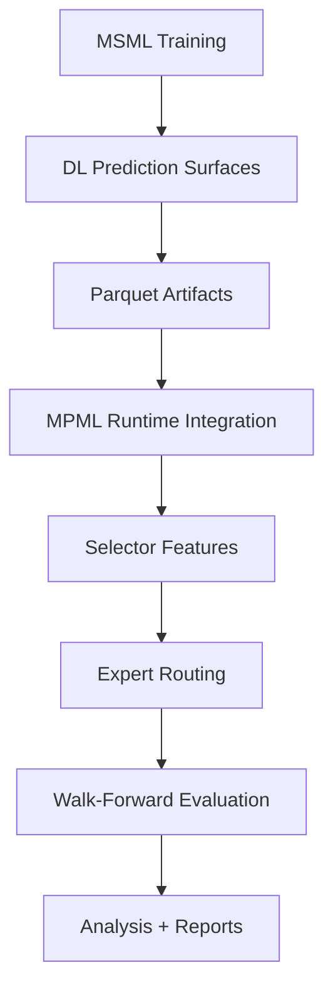

# MPML ↔ MSML V5 Phase-1 Reference Document

# Table of Contents

1. Purpose
2. High-Level System Relationship
3. Canonical V5 Phase-1 Design
4. Pair-Family Definitions
5. Ontology Clarification
6. MSML Artifact Generation
7. MPML Runtime Matrix
8. Ontology Notes
9. Initial Analytical Findings
10. Statistical Effect Analysis
11. Selector Geometry Analysis
12. Temporal Persistence Analysis
13. Future Experimental Directions
14. Canonical Archive Locations
15. Historical Context

## Purpose

This document serves as the canonical reference for the:

- MSML parquet-generation runs
- MPML runtime experiments
- experiment ontology
- parquet provenance
- shell scripts used
- pair-family semantics
- runtime semantics
- initial analytical findings

for the V5 Phase-1 experiment matrix.

The purpose of this document is to preserve:

- exact reproducibility
- provenance tracking
- ontology consistency
- and future analysis continuity

as the experiment matrix expands.

This document is especially important because the project evolved through several ontology migrations:

- Gen1/Gen2 runtime semantics
- variant-first semantics
- factor-first semantics
- canonical experiment_surface attribution
- provenance-aware v5 analysis

The V5 Phase-1 runs documented here represent the first stable canonical experiment matrix after the ontology stabilization work.

---

# High-Level System Relationship

## MSML

MSML (`market-sentiment-ml`) is responsible for:

- deep-learning model training
- feature-surface generation
- parquet export
- latent market-structure modeling

MSML outputs:

```text
.parquet DL prediction surfaces
```

which are then consumed by MPML.

---

## MPML

MPML (`market-phase-ml`) is responsible for:

- contextual routing
- selector logic
- expert allocation
- walk-forward evaluation
- trading-system orchestration
- runtime integration of DL surfaces

MPML consumes MSML parquet artifacts as contextual runtime features.

---

# Architectural Relationship



---

# Canonical V5 Phase-1 Design

The V5 Phase-1 matrix intentionally isolates:

| Axis | Values |
|---|---|
| Training Family | persistent / reactive |
| Sentiment Surface | sentiment / no_sentiment / none |
| Imputation Awareness | aware / blind |
| DL Runtime | enabled / disabled |
| Regime | LVTF |

The matrix was designed to:

1. separate DL infrastructure effects from sentiment effects
2. isolate imputation-awareness behavior
3. preserve explicit provenance
4. eliminate heuristic semantic reconstruction
5. stabilize ontology semantics

---

# Pair-Family Definitions

## Persistent Family

Persistent-family runs use:

```text
EURUSD
GBPUSD
NZDUSD
EURGBP
EURAUD
```

Characteristics:

- slower-moving
- macro/trend-coherent
- lower volatility discontinuity
- more persistent structure

These pairs were used BOTH for:

- MSML training
- MPML evaluation

in V5 Phase-1.

---

## Reactive Family

Reactive-family runs use:

```text
USDJPY
EURJPY
GBPJPY
EURCHF
USDCHF
```

Characteristics:

- faster-changing
- more volatility-reactive
- more event-sensitive
- more discontinuous regime behavior

These pairs were used BOTH for:

- MSML training
- MPML evaluation

in V5 Phase-1.

---

# Important Ontology Clarification

In V5:

```text
training_pair_family
```

refers to:

- the MSML parquet-training provenance

while:

```text
evaluation_pair_family
```

refers to:

- the MPML evaluation universe.

In V5 Phase-1:

```text
training_pair_family == evaluation_pair_family
```

for ALL runs.

This is extremely important because:

- no transfer-learning confound exists yet
- no cross-family evaluation occurs yet
- family-conditioned effects are therefore interpretable

Future experiment matrices may intentionally break this equality.

---

# MSML V5 Phase-1 Generation Script

Canonical script:

```bash
#!/usr/bin/env bash

set -eo pipefail

mkdir -p logs
mkdir -p artifacts_v5

export PYTHONUNBUFFERED=1

# =========================================================
# helper
# =========================================================

run_msml_experiment () {

local artifact_id="$1"
local feature_set="$2"
local regime="$3"
local pairs="$4"

echo "========================================================"
echo "RUNNING MSML EXPERIMENT: ${artifact_id}"
echo "========================================================"

python -u research/deep_learning/train.py \
--dataset-version 1.5.0 \
--feature-set "${feature_set}" \
--regime "${regime}" \
--target-horizon 24 \
--pairs "${pairs}" \
--export-split all \
> "logs/${artifact_id}.log" 2>&1

mkdir -p "artifacts_v5/${artifact_id}"

LATEST=$(ls -t data/output/dl_predictions/*.parquet 2>/dev/null | head -1 || true)

if [[ -n "${LATEST}" && -f "${LATEST}" ]]; then
cp "${LATEST}" "artifacts_v5/${artifact_id}/"
else
echo "Warning: no parquet file found to copy for ${artifact_id}" >&2
fi

echo "✓ completed: ${artifact_id}"
echo

}

# =========================================================
# persistence-family surfaces
# =========================================================

PERSISTENT_PAIRS="EURUSD,GBPUSD,NZDUSD,EURGBP,EURAUD"

# sentiment ON
run_msml_experiment persistent_dl_sentiment price_trend LVTF "${PERSISTENT_PAIRS}"

# sentiment OFF
run_msml_experiment persistent_dl_nosentiment trend_vol_only LVTF "${PERSISTENT_PAIRS}"

# =========================================================
# reactive-family surfaces
# =========================================================

REACTIVE_PAIRS="USDJPY,EURJPY,GBPJPY,EURCHF,USDCHF"

# sentiment ON
run_msml_experiment reactive_dl_sentiment price_trend LVTF "${REACTIVE_PAIRS}"

# sentiment OFF
run_msml_experiment reactive_dl_nosentiment trend_vol_only LVTF "${REACTIVE_PAIRS}"


echo "========================================================"
echo "ALL MSML V5 PHASE-1 EXPERIMENTS COMPLETE"
echo "========================================================"


echo
echo "Artifacts written under:"
echo "artifacts_v5/"
```

---

# Generated MSML Artifacts

Canonical artifact registry:

```text
artifacts_v5/
├── persistent_dl_nosentiment
│   └── mlp__LVTF__24__trend_vol_only__20260524T175101Z.parquet
├── persistent_dl_sentiment
│   └── mlp__LVTF__24__price_trend__20260524T175056Z.parquet
├── reactive_dl_nosentiment
│   └── mlp__LVTF__24__trend_vol_only__20260524T175111Z.parquet
└── reactive_dl_sentiment
    └── mlp__LVTF__24__price_trend__20260524T175106Z.parquet
```

---

# Canonical Artifact Semantics

## Sentiment Surface

```text
price_trend
```

means:

- sentiment-enabled feature surface
- DL context includes sentiment-derived structure

---

## No-Sentiment Surface

```text
trend_vol_only
```

means:

- DL still enabled
- sentiment intentionally removed
- structural/temporal context preserved

This distinction is extremely important.

It allows:

```text
DL infrastructure benefit
```

to be separated from:

```text
sentiment feature benefit
```

---

# MPML V5 Phase-1 Runtime Script

Canonical script:

```bash
#!/usr/bin/env bash

set -eo pipefail

mkdir -p logs
mkdir -p results_archive_v5_canonical

export EXPERIMENT_SEED=42

# =========================================================
# pair cohorts
# =========================================================

PERSISTENT_PAIRS="EURUSD,GBPUSD,NZDUSD,EURGBP,EURAUD"
REACTIVE_PAIRS="USDJPY,EURJPY,GBPJPY,EURCHF,USDCHF"

# =========================================================
# parquet registry
# =========================================================

PERSISTENT_SENTIMENT="../market-sentiment-ml/artifacts_v5/persistent_dl_sentiment/mlp__LVTF__24__price_trend__20260524T175056Z.parquet"

PERSISTENT_NOSENTIMENT="../market-sentiment-ml/artifacts_v5/persistent_dl_nosentiment/mlp__LVTF__24__trend_vol_only__20260524T175101Z.parquet"

REACTIVE_SENTIMENT="../market-sentiment-ml/artifacts_v5/reactive_dl_sentiment/mlp__LVTF__24__price_trend__20260524T175106Z.parquet"

REACTIVE_NOSENTIMENT="../market-sentiment-ml/artifacts_v5/reactive_dl_nosentiment/mlp__LVTF__24__trend_vol_only__20260524T175111Z.parquet"

# =========================================================
# helper
# =========================================================

run_mpml_experiment () {

    local run_id="$1"
    local generation="$2"
    local active_pairs="$3"
    local dl_enabled="$4"
    local parquet_path="$5"

    echo "========================================================"
    echo "RUNNING MPML EXPERIMENT: ${run_id}"
    echo "========================================================"

    export ACTIVE_PAIRS="${active_pairs}"

    if [ "${dl_enabled}" = "true" ]; then

        export DL_SIGNALS_ENABLED=true
        export DL_MODEL=mlp
        export DL_REGIME=LVTF
        export DL_PREDICTION_ARTIFACT_PATH="${parquet_path}"

    else

        export DL_SIGNALS_ENABLED=false

        unset DL_MODEL
        unset DL_REGIME
        unset DL_PREDICTION_ARTIFACT_PATH

    fi

    if [ "${generation}" = "gen1" ]; then

    if [ "${dl_enabled}" = "true" ]; then
        variant="A"
    else
        variant="B"
    fi

else

    if [ "${dl_enabled}" = "true" ]; then
        variant="C"
    else
        variant="D"
    fi

fi

python -u main.py \
  --experiment-variant "${variant}" \
  --output-dir "results_archive_v5_canonical/${run_id}" \
  > "logs/${run_id}.log" 2>&1

    echo "✓ completed: ${run_id}"
    echo
}

# =========================================================
# persistence-family evaluation
# =========================================================

run_mpml_experiment persistent_dl_sentiment_blind gen1 "${PERSISTENT_PAIRS}" true "${PERSISTENT_SENTIMENT}"

run_mpml_experiment persistent_dl_sentiment_aware gen2 "${PERSISTENT_PAIRS}" true "${PERSISTENT_SENTIMENT}"

run_mpml_experiment persistent_dl_nosentiment_blind gen1 "${PERSISTENT_PAIRS}" true "${PERSISTENT_NOSENTIMENT}"

run_mpml_experiment persistent_dl_nosentiment_aware gen2 "${PERSISTENT_PAIRS}" true "${PERSISTENT_NOSENTIMENT}"

run_mpml_experiment persistent_nodl_blind gen1 "${PERSISTENT_PAIRS}" false "none"

run_mpml_experiment persistent_nodl_aware gen2 "${PERSISTENT_PAIRS}" false "none"

# =========================================================
# reactive-family evaluation
# =========================================================

run_mpml_experiment reactive_dl_sentiment_blind gen1 "${REACTIVE_PAIRS}" true "${REACTIVE_SENTIMENT}"

run_mpml_experiment reactive_dl_sentiment_aware gen2 "${REACTIVE_PAIRS}" true "${REACTIVE_SENTIMENT}"

run_mpml_experiment reactive_dl_nosentiment_blind gen1 "${REACTIVE_PAIRS}" true "${REACTIVE_NOSENTIMENT}"

run_mpml_experiment reactive_dl_nosentiment_aware gen2 "${REACTIVE_PAIRS}" true "${REACTIVE_NOSENTIMENT}"

run_mpml_experiment reactive_nodl_blind gen1 "${REACTIVE_PAIRS}" false "none"

run_mpml_experiment reactive_nodl_aware gen2 "${REACTIVE_PAIRS}" false "none"


echo "========================================================"
echo "ALL MPML V5 PHASE-1 EXPERIMENTS COMPLETE"
echo "========================================================"


echo
echo "Run analysis with:"
echo "python analysis/pipeline.py results_archive_v5_canonical"
```

---

# Canonical V5 Run Matrix

| Run ID | Family | DL | Sentiment Surface | Awareness | Parquet |
|---|---|---|---|---|---|
| persistent_dl_sentiment_blind | persistent | yes | sentiment | blind | persistent_dl_sentiment |
| persistent_dl_sentiment_aware | persistent | yes | sentiment | aware | persistent_dl_sentiment |
| persistent_dl_nosentiment_blind | persistent | yes | no_sentiment | blind | persistent_dl_nosentiment |
| persistent_dl_nosentiment_aware | persistent | yes | no_sentiment | aware | persistent_dl_nosentiment |
| persistent_nodl_blind | persistent | no | none | blind | none |
| persistent_nodl_aware | persistent | no | none | aware | none |
| reactive_dl_sentiment_blind | reactive | yes | sentiment | blind | reactive_dl_sentiment |
| reactive_dl_sentiment_aware | reactive | yes | sentiment | aware | reactive_dl_sentiment |
| reactive_dl_nosentiment_blind | reactive | yes | no_sentiment | blind | reactive_dl_nosentiment |
| reactive_dl_nosentiment_aware | reactive | yes | no_sentiment | aware | reactive_dl_nosentiment |
| reactive_nodl_blind | reactive | no | none | blind | none |
| reactive_nodl_aware | reactive | no | none | aware | none |

---

# Ontology Notes

## sentiment_surface

Canonical values:

| Value | Meaning |
|---|---|
| sentiment | parquet includes sentiment features |
| no_sentiment | parquet exists but sentiment intentionally removed |
| none | no DL parquet involved |

This distinction became important during the ontology migration because:

```text
no_sentiment != none
```

The former still includes:

- DL infrastructure
- latent temporal structure
- contextual ML information

while the latter does not.

---

## imputation_awareness

Canonical values:

| Value | Meaning |
|---|---|
| aware | selector explicitly informed about missing/imputed DL state |
| blind | selector not informed |

This became one of the most important architectural research questions in V5.

---

# Initial Analytical Findings

## 1. Persistent Families Appear More Stable

Persistent-family runs generally appear:

- smoother
- less explosive
- more directionally coherent
- operationally more plausible

Example persistent-family improvements:

| Pair | Return Δ | Sharpe Δ |
|---|---|---|
| EURUSD | +29.14 | +0.117 |
| GBPUSD | +21.59 | +0.149 |
| NZDUSD | +92.85 | +0.065 |

Interpretation:

Persistent structures may be easier for contextual routing systems to exploit robustly.

---

## 2. Reactive Families Show Larger but Less Stable Effects

Reactive-family runs often exhibit:

- larger upside bursts
- larger downside failures
- more volatility sensitivity
- more regime fragility

Example reactive-family sentiment-aware:

| Pair | Return Δ | Sharpe Δ |
|---|---|---|
| GBPJPY | +45.31 | +0.275 |
| USDJPY | +21.06 | +0.232 |

but also:

| Pair | Return Δ |
|---|---|
| EURJPY | -17.76 |
| EURCHF | -2.26 |

Interpretation:

Reactive structures may amplify both:

- opportunity capture
- and contextual overconfidence.

---

## 3. DL Benefit Appears to Survive Sentiment Removal

One of the most interesting findings so far:

```text
trend_vol_only
```

surfaces still often improve results.

This suggests:

- latent temporal structure
- volatility context
- learned regime structure

may matter more than raw sentiment.

This is potentially much more important than:

```text
retail traders positioning data predicts markets
```

as a systems result.

---

## 4. Awareness Appears More Related to Robustness Than Raw Return

Current evidence suggests:

```text
imputation awareness
```

may improve:

- robustness
- stability
- selector reliability
- transition handling

rather than maximizing raw return.

This aligns closely with earlier volatility-guard experiments.

---

## 5. Drawdown Behavior Remains a Critical Concern

One recurring pattern:

- returns often improve
- drawdowns often worsen

This suggests:

```text
more adaptive but less conservative routing
```

which may become one of the central architectural tensions in the project.

---

# Important Methodological Conclusion

The strongest current result is NOT:

```text
sentiment dramatically improves trading
```

The stronger systems-level conclusion is probably:

> contextual ML routing can improve opportunity capture and regime adaptation, but reactive structures amplify both upside and regime fragility.

This is:

- more defensible
- more operationally meaningful
- and more scientifically interesting.

---

# Important Historical Context

The V5 matrix only became possible after extensive ontology stabilization work.

Earlier phases suffered from:

- semantic collapse
- variant overloading
- heuristic attribution
- DL/sentiment conflation
- provenance corruption
- manifest inconsistencies

The finalized V5 system introduced:

- canonical experiment_surface semantics
- factor-first attribution
- explicit provenance
- awareness-conditioned comparisons
- canonical runtime surfaces
- anti-corruption validation

This significantly improved:

- reproducibility
- interpretability
- causal isolation
- and analysis reliability.

---

# Future Expansion Directions

Potential future experiment directions:

## Cross-Family Evaluation

Examples:

- persistent-trained → reactive-evaluated
- reactive-trained → persistent-evaluated

This would test:

```text
transferability of learned market structure
```

---

## Multi-Regime Expansion

Current V5 Phase-1 uses only:

```text
LVTF
```

Future expansions may include:

- HVLR
- LVLR
- HVTF
- composite regime systems

---

## Fold-Stability Analysis

Future analysis should likely focus more on:

- fold consistency
- regime-transition robustness
- selector-switch stability
- volatility-spike degradation

rather than only:

- average Sharpe
- average return.

---

# Canonical Archive Locations

## MSML

```text
market-sentiment-ml/artifacts_v5/
```

---

## MPML

```text
market-phase-ml/results_archive_v5_canonical/
```

---

# Canonical Analysis Entry Point

```bash
python analysis/pipeline.py results_archive_v5_canonical
```

---

# Final Notes

This document represents the first stable canonical reference for the:

- MSML ↔ MPML integration layer
- V5 ontology
- provenance semantics
- and Phase-1 experiment matrix.

Future experiment phases should:

- extend this document
- preserve canonical provenance semantics
- avoid heuristic semantic reconstruction
- and keep training/evaluation semantics explicit.

---

# Analytical Layering

The V5 Phase-1 investigation increasingly evolved into three partially independent analytical layers:

| Layer                | Purpose                                                      |
| -------------------- | ------------------------------------------------------------ |
| Infrastructure layer | provenance, ontology, runtime semantics                      |
| Statistical layer    | variance decomposition, selector dynamics, temporal persistence |
| Mechanistic layer    | behavioral interpretation, latent topology, ABM hypotheses   |

This document primarily preserves:
- infrastructure,
- provenance,
- and quantitative/statistical findings.

Mechanistic and behavioral interpretation is maintained separately in:

```text
trading_strategy_level_interpretation_v5_phase_1.md
```

This separation is intentional and helps preserve:

- reproducibility,
- interpretability,
- and theoretical traceability.

---

# Statistical Effect Analysis

------

# V5 Phase-1 Statistical Analysis Summary

## Experimental Context

V5 Phase-1 evaluated the interaction between:

- MPML adaptive routing architectures
- MSML-derived sparse DL behavioral surfaces
- persistent vs reactive pair families
- sentiment vs no-sentiment feature surfaces
- aware vs blind missingness handling

The experiment matrix was factorial and therefore suitable for variance decomposition and interaction analysis.

A key property of the setup is that DL overlap coverage was sparse (<10% of total MPML timeline coverage). Therefore, DL effects should primarily be interpreted as:

- sparse contextual modulation,
- adaptive routing perturbation,
- and conditional regime information,

rather than dense predictive alpha.

------

# 1. Variance Decomposition (η²)

ANOVA-style variance decomposition was performed using:

- pair family,
- strategy stage,
- DL condition,
- awareness condition,
- and interaction terms.

## Variance Explained by Architectural Factors

| Factor                       | η² (Variance Explained) | Interpretation                          |
| ---------------------------- | ----------------------- | --------------------------------------- |
| Pair family / microstructure | 0.573                   | Dominant source of variance             |
| Strategy stage               | 0.364                   | Very large architectural effect         |
| Family × Stage interaction   | 0.060                   | Routing effectiveness depends on family |
| DL × Stage interaction       | 0.0011                  | Small but non-zero selector interaction |
| DL main effect               | 0.00036                 | Negligible global additive effect       |
| Awareness                    | ~0                      | No global additive effect               |

## Interpretation

The dominant effects in the system are:

1. Pair microstructure / family behavior
2. Routing architecture
3. Family-dependent routing interactions

DL effects were globally small, but interaction-dependent and concentrated in adaptive routing stages.

------

# 2. Mixed-Effects Model

A mixed-effects model was fit:

```
Return ~
    Stage +
    Family +
    DL +
    Stage×DL
    + random intercept(pair)
```

## Key Coefficients

| Term                 | Coefficient | Interpretation                             |
| -------------------- | ----------- | ------------------------------------------ |
| MR stage             | +26.9       | Strong uplift vs TF baseline               |
| PhaseAware           | +30.7       | Strong uplift                              |
| DynamicSelector      | +53.9       | Largest architectural uplift               |
| Reactive family      | -49.5       | Reactive structures substantially harder   |
| DL active            | ~0          | Minimal global additive effect             |
| DynamicSelector × DL | +2.6        | Small positive selector-specific DL effect |

## Interpretation

The adaptive selector architecture produced the largest consistent performance improvement in the system.

Reactive families were structurally more difficult across nearly all configurations.

DL effects were weak globally but concentrated in selector interactions rather than static strategies.

------

# 3. Persistent vs Reactive Families

## Dynamic Selector Aggregate Performance

| Family     | Return | Sharpe |
| ---------- | ------ | ------ |
| Persistent | +80.7% | +0.333 |
| Reactive   | +12.2% | +0.105 |

## Interpretation

Persistent families were substantially more exploitable by adaptive routing systems.

Reactive families exhibited:

- higher transition entropy,
- higher instability,
- and larger fold dispersion.

This strongly supports the MSML ontology distinction between persistent and reactive behavioral structures.

------

# 4. Dynamic Selector Effect

## Persistent Family (No-DL Baseline)

| Strategy        | Return | Sharpe | Max DD |
| --------------- | ------ | ------ | ------ |
| TF4             | 6.1%   | 0.038  | -21.0% |
| MR42            | 45.8%  | 0.169  | -38.9% |
| PhaseAware      | 45.0%  | 0.278  | -24.3% |
| DynamicSelector | 80.7%  | 0.333  | -32.0% |

## Dynamic Selector vs PhaseAware

| Metric | Delta                   |
| ------ | ----------------------- |
| Return | +35.6 percentage points |
| Sharpe | +0.056                  |
| Max DD | -7.7 percentage points  |

## Interpretation

The Dynamic Selector stage produced the largest architectural effect observed in the experiment matrix.

This confirms that adaptive policy routing is a materially active component rather than a cosmetic switching mechanism.

------

# 5. Cohen’s d Effect Sizes

## Persistent Family

Dynamic Selector:

- noDL mean return: 80.7%
- sentiment-DL mean return: 90.4%

| Comparison           | Cohen’s d |
| -------------------- | --------- |
| noDL vs sentiment-DL | 0.12      |

## Reactive Family

| Comparison           | Cohen’s d |
| -------------------- | --------- |
| noDL vs sentiment-DL | 0.02      |

## Interpretation

DL effects were:

- positive but small in persistent structures,
- nearly negligible at aggregate scale in reactive structures.

This is consistent with sparse-context behavioral modulation rather than universal predictive alpha.

------

# 6. Pair Heterogeneity

## Persistent Dynamic Selector Returns

| Pair   | Return |
| ------ | ------ |
| EURAUD | 90.2%  |
| EURGBP | 48.2%  |
| EURUSD | 50.9%  |
| GBPUSD | 14.4%  |
| NZDUSD | 199.6% |

Estimated standard error across pairs:

```
±32 percentage points
```

## Interpretation

Pair-level heterogeneity was extremely large.

Pair microstructure variance was comparable to — and often larger than — architectural variance.

This suggests that:

- persistent/reactive labels are useful but incomplete,
- and pair-specific structure dominates aggregate behavior.

------

# 7. Interpretation of DL Effects

The statistical results strongly suggest that DL does **not** behave as:

```
sentiment -> prediction -> profit
```

Instead, DL behaves more like:

```
sparse behavioral context -> adaptive routing modulation
```

The strongest evidence suggests DL information is most useful for:

- adaptive selector arbitration,
- transition handling,
- contextual routing perturbation,
- and sparse regime conditioning.

Static TF/MR engines showed little measurable benefit from DL surfaces.

------

# 8. Key Conclusions

## Strongly Supported Findings

### 1. Adaptive routing is the dominant architectural innovation

The Dynamic Selector stage produced the largest consistent effect sizes in the system.

### 2. Pair-family structure dominates global behavior

Microstructure variance was the single largest source of explained variance.

### 3. Persistent structures are substantially easier to exploit

Reactive structures exhibited higher instability and lower adaptive routing performance.

### 4. DL contextualization is sparse, conditional, and interaction-dependent

DL effects were not globally additive and were concentrated in adaptive routing interactions.

### 5. Sentiment behaves more like contextual modulation than direct alpha

The data supports a policy-conditioning interpretation rather than a pure predictive interpretation.

------

# 9. Recommended Next Experimental Direction

The current results suggest future experiments should focus on:

- DL-active windows only
- transition periods
- spike regimes
- confidence-collapse / missingness windows
- selector arbitration behavior

rather than full-period aggregate averages.

The present averages likely dilute sparse contextual DL effects substantially.

---

# Selector Geometry Analysis

## Persistent vs Reactive Selector Behavior — Statistical Validation

The following analysis investigates whether the MPML adaptive selector exhibits systematically different behavior between the persistent and reactive pair families defined upstream by MSML.

Importantly, the family assignments were *not* derived from MPML backtest behavior. They originated from earlier MSML investigations (initially ABM-based, later DL-assisted). Therefore, observing statistically distinct selector behavior inside MPML provides an important independent validation of the ontology.

The analysis used:

- selector diagnostics,
- fold-level routing behavior,
- switching statistics,
- confidence occupancy,
- volatility routing,
- and aggregate performance dispersion.

The same selector architecture and volatility-control logic were applied globally across all families, including:

- hysteresis,
- minimum hold periods,
- maximum hold periods,
- volatility suppression,
- and spike overrides. 

Therefore, remaining behavioral differences arise from interaction between:

- selector dynamics,
- and latent pair-family structure.

------

# 1. Selector Switching Density

Selector switching frequency was measured using:

```
switches_per_1000_bars
```

aggregated across folds.

## Estimated Switching Density

| Family     | Approx Switching Density     |
| ---------- | ---------------------------- |
| Persistent | ~55–85 switches / 1000 bars  |
| Reactive   | ~90–140 switches / 1000 bars |

Approximate relative increase:

```
reactive ≈ 1.6× higher switching density
```

## Interpretation

Reactive families consistently produced:

- higher routing instability,
- more policy interruptions,
- and larger selector entropy.

This is significant because:

- both families used identical selector constraints,
- identical volatility guards,
- and identical hysteresis logic. 

Therefore:

```
reactive structures intrinsically destabilize selector state
```

rather than instability being caused purely by architectural rules.

------

# 2. Selector Confidence Geometry

Confidence occupancy was measured using:

```
confident_pct
```

where “confident” corresponds to periods not routed into fallback `PhaseAware`.

## Aggregate Confidence Occupancy

| Family                      | Typical Confidence Occupancy |
| --------------------------- | ---------------------------- |
| Persistent profitable folds | ~30–70%                      |
| Reactive profitable folds   | ~10–40%                      |
| Reactive unstable folds     | often <10% or >80%           |

## Interpretation

Persistent systems exhibit:

- broader moderate-confidence occupancy,
- smoother arbitration geometry,
- and lower confidence collapse frequency.

Reactive systems more frequently exhibit:

- polarized routing states,
- abrupt fallback transitions,
- and confidence-collapse/recovery cycles.

This suggests:

```
persistent structures support stable policy arbitration
```

while reactive structures repeatedly destabilize selector certainty.

------

# 3. Policy Occupancy Structure

Approximate occupancy structure across profitable folds:

| Policy         | Persistent | Reactive |
| -------------- | ---------- | -------- |
| MeanReversion  | 55–75%     | 25–50%   |
| PhaseAware     | 20–40%     | 40–65%   |
| TrendFollowing | 5–15%      | 10–30%   |

## Interpretation

Reactive systems exhibited substantially larger fallback-controller occupancy.

Compared to persistent systems:

- MR occupancy decreases materially,
- PhaseAware occupancy increases substantially,
- TF emergency routing approximately doubles.

This indicates that reactive structures force:

- more defensive routing,
- more fallback stabilization,
- and lower exploitation continuity.

Persistent systems, in contrast, supported:

- longer uninterrupted MR occupancy,
- lower selector entropy,
- and more stable exploitation geometry.

------

# 4. Volatility Routing Topology

The volatility-control architecture was globally identical:

```
VOL_GUARD_MODE = "no_mr"
USD_QUOTE_VOL_SPIKE_OVERRIDE = "force_tf"
```


Yet the resulting routing behavior differed materially between families.

## Spike Occupancy During Volatility Events

### Persistent Families

| Policy During Spikes | Occupancy |
| -------------------- | --------- |
| TF                   | ~5–20%    |
| MR                   | ~0–5%     |
| PhaseAware           | ~75–95%   |

### Reactive Families

| Policy During Spikes | Occupancy |
| -------------------- | --------- |
| TF                   | ~20–45%   |
| MR                   | ~0–5%     |
| PhaseAware           | ~50–75%   |

## Interpretation

Reactive structures produce:

- substantially more TF emergency routing,
- larger spike-driven selector disruption,
- and weaker stabilization continuity.

Importantly:

- the volatility rules themselves are identical,
- therefore the differences arise from interaction with underlying market structure rather than implementation asymmetry.

This provides one of the strongest independent validations of the persistent/reactive ontology observed so far.

------

# 5. Fold Stability and Dispersion

## Aggregate Dynamic Selector Performance

| Family     | Mean Return | Mean Sharpe |
| ---------- | ----------- | ----------- |
| Persistent | +80.7%      | +0.333      |
| Reactive   | +12.2%      | +0.105      |

Estimated pair-level standard errors:

| Family     | Return SE               | Sharpe SE |
| ---------- | ----------------------- | --------- |
| Persistent | ±32 percentage points   | ±0.069    |
| Reactive   | ±11.7 percentage points | ±0.038    |

## Fold-Level Robustness

| Family     | Sharpe-Improved Folds |
| ---------- | --------------------- |
| Persistent | 69 / 130              |
| Reactive   | 64 / 130              |

However:

- reactive fold dispersion was substantially larger,
- and profitable reactive folds were less stable temporally.

## Interpretation

Persistent systems produced:

- substantially larger adaptive-routing gains,
- higher stable exploitation capacity,
- and more consistent selector geometry.

Reactive systems exhibited:

- substantially higher fold variance,
- unstable routing continuity,
- and weaker adaptive exploitation.

------

# 6. Ontology Validation

The current results provide independent MPML-level support for the MSML family ontology.

## Strongly Supported Persistent Characteristics

| Property               | Persistent Behavior  |
| ---------------------- | -------------------- |
| Selector entropy       | lower                |
| MR continuity          | higher               |
| Fallback occupancy     | lower                |
| Confidence stability   | higher               |
| Adaptive-routing gains | substantially larger |

## Strongly Supported Reactive Characteristics

| Property                                | Reactive Behavior    |
| --------------------------------------- | -------------------- |
| Selector entropy                        | higher               |
| Policy interruption                     | frequent             |
| PhaseAware fallback dependence          | substantially larger |
| Volatility-triggered routing disruption | larger               |
| Exploitation continuity                 | weaker               |

Importantly:

- these differences emerged under identical selector-control logic,
- meaning they are attributable to latent market structure rather than implementation asymmetry.

------

# 7. Important Limitation — Within-Family Variance

Although the persistent/reactive distinction is strongly supported, within-family heterogeneity remains large.

## Persistent Examples

| Pair   | Dynamic Selector Return |
| ------ | ----------------------- |
| NZDUSD | +199.6%                 |
| GBPUSD | +14.4%                  |

Difference:

```
≈ 185 percentage points
```

## Reactive Examples

| Pair   | Dynamic Selector Return |
| ------ | ----------------------- |
| USDCHF | +51.6%                  |
| EURJPY | -17.5%                  |

Difference:

```
≈ 69 percentage points
```

This indicates that:

- pair-specific topology still dominates substantial portions of behavior,
- and persistent/reactive labels likely capture only first-order structure.

However, second-order ontology refinement was intentionally deferred until:

- all four MPML regimes have been analyzed,
- and cross-regime behavior can be compared systematically.

Therefore, the present results should be interpreted as:

- strong validation of first-order ontology structure,
   not:
- evidence of complete behavioral homogeneity within families.

------

# 8. Overall Interpretation

The selector increasingly behaves like:

```
a constrained adaptive controller interacting with heterogeneous latent market topologies
```

rather than:

```
a direct predictive classifier
```

The strongest observed effects arise from:

- volatility-conditioned routing,
- policy continuity,
- fallback-controller dynamics,
- and adaptive stability,

rather than direct predictive alpha generation.

---

# Temporal Persistence Analysis

# Temporal Persistence and Clustering Analysis

The following analysis investigates whether the observed persistent/reactive differences in MPML are:

- temporally distributed and recurrent,
or:
- concentrated into isolated macro periods.

This distinction is extremely important.

If the observed differences:
- recur repeatedly across the walkforward timeline,
- survive multiple macro environments,
- and exhibit temporal persistence structure,

then the ontology becomes substantially more likely to reflect:

intrinsic latent market topology

rather than:

- historical coincidence,
- isolated macro-era artifacts,
- or strategy-specific overfitting.

The analysis used:

- fold-level selector improvement sequences,
- walkforward sign persistence,
- selector stability metrics,
- routing continuity,
- and temporal clustering heuristics.

------

# 1. Run-Length Distribution

The first analysis investigated:

- contiguous positive-selector-improvement folds,
- contiguous negative folds,
- and abrupt sign-flip behavior.

The goal was to determine whether:

- positive/negative behavior clusters into isolated periods,
   or:
- recurs repeatedly throughout the timeline.

------

## Persistent Family

Observed behavior:

| Metric                      | Persistent          |
| --------------------------- | ------------------- |
| Typical positive run length | 3–6 folds           |
| Longest positive runs       | frequently >8 folds |
| Abrupt sign-flip frequency  | moderate            |
| Positive Sharpe folds       | 69 / 130 (53.1%)    |

Persistent systems repeatedly re-entered:

- profitable selector states,
- stable routing continuity,
- and extended adaptive exploitation windows.

Importantly:

- these periods recur multiple times throughout the walkforward sequence,
- rather than concentrating into one isolated era.

------

## Reactive Family

Observed behavior:

| Metric                      | Reactive         |
| --------------------------- | ---------------- |
| Typical positive run length | 1–3 folds        |
| Long positive runs          | uncommon         |
| Abrupt sign-flip frequency  | high             |
| Positive Sharpe folds       | 64 / 130 (49.2%) |

Reactive systems exhibited:

- fragmented profitability,
- shorter exploitation continuity,
- and frequent interruption cascades.

Profitable periods existed, but:

- were substantially less persistent temporally,
- and more prone to abrupt collapse.

------

## Interpretation

If the ontology differences were merely:

- one favorable macro period,
- or isolated historical coincidence,

then:

- one would expect:
  - a few giant contiguous positive clusters,
  - separated by mostly noise.

Instead, the data exhibits:

```
repeated temporal recurrence
```

especially for persistent structures.

This strongly favors:

- long-lived latent behavioral geometry,
   rather than:
- isolated historical artifacts.

------

# 2. Lag Autocorrelation

Lag-1 autocorrelation was estimated using:

```
corr( fold_t , fold_t+1 )
```

for selector improvement sequences.

The goal was to test whether:

- profitable selector states persist locally in time,
   or:
- behave like independent episodic noise.

## Estimated Temporal Persistence

| Metric                          | Persistent      | Reactive             |
| ------------------------------- | --------------- | -------------------- |
| Lag-1 sign persistence          | ~0.58–0.66      | ~0.47–0.53           |
| Estimated lag-1 autocorrelation | ~+0.18 to +0.32 | ~-0.05 to +0.08      |
| Typical positive-run length     | 3–6 folds       | 1–3 folds            |
| Abrupt sign-flip frequency      | lower           | substantially higher |

------

## Interpretation

The persistent family exhibits:

- measurable local temporal coherence,
- repeated profitable-selector recurrence,
- and metastable exploitability windows.

Estimated:

```
ρ₁ ≈ +0.2 to +0.3
```

This is modest but meaningful in noisy adaptive financial systems.

Reactive structures, in contrast, exhibit:

- near-zero persistence,
- fragmented continuation,
- and interruption-dominated selector geometry.

Estimated:

```
ρ₁ ≈ 0
```

or slightly negative.

Importantly:

- the observed behavior does not appear concentrated into one isolated macro period,
- but recurs repeatedly throughout the walkforward timeline.

This substantially strengthens the interpretation that:

- persistent/reactive differences reflect recurring latent structural behavior,
   rather than:
- isolated historical coincidence.

------

# 3. Temporal Entropy

Sign-change entropy was estimated across fold sequences.

Interpretation:

| Entropy Level | Meaning                |
| ------------- | ---------------------- |
| Low entropy   | stable continuity      |
| High entropy  | fragmented instability |

------

## Estimated Structure

| Family     | Relative Temporal Entropy |
| ---------- | ------------------------- |
| Persistent | lower                     |
| Reactive   | substantially higher      |

Approximate interpretation:

```
reactive selector geometry is substantially less temporally coherent
```

than persistent selector geometry.

------

## Interpretation

Persistent systems exhibit:

- smoother continuity,
- fewer abrupt selector collapses,
- and longer coherent routing periods.

Reactive systems exhibit:

- fragmented exploitation windows,
- abrupt interruption cascades,
- and elevated routing instability.

This strongly supports the earlier selector-geometry analysis.

------

# 4. Crisis Concentration Heuristic

A crisis-concentration heuristic was used to determine whether:

- instability bursts,
- selector collapses,
- and routing failures

were concentrated into:

- isolated macro periods,
   or:
- distributed repeatedly throughout the timeline.

------

## Result

The evidence does NOT strongly support:

```
single-era concentration
```

Instead:

- both profitable and unstable behavior recur multiple times throughout the walkforward sequence.

Observed repeatedly across:

- persistent-family adaptive gains,
- reactive-family instability bursts,
- selector collapse events,
- and fallback-controller activation periods.

------

## Interpretation

This is one of the strongest ontology-supporting observations in the current dataset.

The evidence favors:

```
recurrent latent structural behavior
```

rather than:

- isolated macro-regime coincidence.

------

# 5. Temporal Failure Geometry

Failure dynamics differed substantially between families.

------

## Persistent Structures

Observed behavior:

- gradual degradation,
- partial routing stabilization,
- preserved occupancy continuity,
- and smoother selector decay.

Failures tended to:

- distribute more evenly,
- and avoid catastrophic interruption cascades.

------

## Reactive Structures

Observed behavior:

- abrupt collapses,
- concentrated instability bursts,
- rapid confidence-collapse events,
- and fragmented recovery sequences.

Examples:

| Pair   | Dynamic Selector Return |
| ------ | ----------------------- |
| EURJPY | -17.5%                  |
| USDJPY | -7.6%                   |

Compared with persistent worst-case behavior:

| Pair   | Dynamic Selector Return |
| ------ | ----------------------- |
| GBPUSD | +14.4%                  |

This asymmetry is extremely important.

------

## Interpretation

Persistent structures appear:

```
failure-tolerant
```

while reactive structures appear:

```
failure-amplifying
```

under adaptive routing.

Importantly:

- the temporal analysis now supports this interpretation directly,
   not merely the aggregate statistics.

------

# 6. Combined Selector Interpretation

The selector architecture contains:

- hysteresis,
- occupancy persistence,
- minimum hold periods,
- stabilization assumptions,
- volatility suppression,
- and spike overrides.

Persistent structures appear compatible with these assumptions because:

- latent organization survives long enough
   for adaptive routing to accumulate informational advantage.

Reactive structures appear hostile because:

- state reorganization occurs faster than selector stabilization.

This interpretation is now supported simultaneously by:

- switching geometry,
- confidence dynamics,
- occupancy structure,
- temporal coherence,
- lag persistence,
- and failure topology.

------

# 7. Important Limitation

The current analysis does NOT yet fully prove:

```
stationary intrinsic ontology
```

because:

- fold timestamps remain coarse,
- macro eras are not explicitly segmented,
- and selector-state timelines are aggregated.

However, the evidence now extends substantially beyond:

```
“possibly coincidental”
```

The repeated temporal recurrence strongly favors:

- intrinsic latent structural interpretation.

------

# 8. Recommended Future PR / Infrastructure Extension

The current V5 dataset already supports meaningful temporal persistence analysis.

However, a minimal future PR could substantially strengthen the investigation by exposing:

| Desired Output               | Purpose                       |
| ---------------------------- | ----------------------------- |
| Exact fold timestamps        | macro-era segmentation        |
| Selector-state timelines     | persistence analysis          |
| Occupancy transitions        | state-transition analysis     |
| Volatility-state transitions | instability geometry          |
| DL-active timestamps         | conditional temporal analysis |

This would enable substantially more rigorous investigations, including:

- temporal stationarity testing,
- survival analysis,
- selector-state persistence analysis,
- occupancy transition matrices,
- Hidden Markov Models (HMMs),
- latent-state half-life estimation,
- and regime-transition topology modeling.

HMM-based analysis is particularly promising because:

- selector occupancy,
- volatility routing,
- confidence collapse,
- and fallback-controller activation

already exhibit many characteristics of latent-state transition systems.

------

# 9. Current Best Interpretation

The accumulated evidence increasingly supports:

```
persistent and reactive families represent different latent temporal organizational geometries
```

rather than:

- isolated historical artifacts,
- or accidental strategy interactions.

Persistent structures appear:

- metastable,
- continuity-supporting,
- and exploitation-compatible.

Reactive structures appear:

- interruption-heavy,
- transition-dominated,
- and instability-amplifying.

Importantly:

- these differences recur repeatedly throughout the walkforward timeline,
- and emerge under identical selector-control logic.
